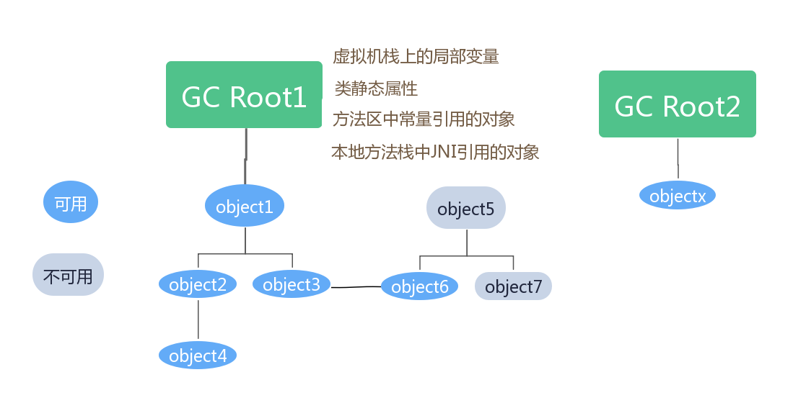

&emps;垃圾收集是C++与Java的一大不同点，C++中需要手动释放内存，编写析构函数。而JVM则由后台垃圾收集线程帮我们处理垃圾对象，减少了开发人员写代码忘记编写析构，或错误析构的可能。在JVM内存结构中已经大致了解过heap堆的分代。现在的垃圾收集器基本都采用分代收集算法。因为某论文中证明大多数对象是朝生夕死的，分代算法提高垃圾收集的效率。

### 标记垃圾对象
&emsp;那么，首先的问题是，JVM怎么知道哪些对象是需要收集的呢？在对象头的Mark Word标记字中，锁标志位（01无锁或偏向锁，00轻量级锁，10重量级锁，11GC标记）为11的话就表示该对象就要被回收了。那么是用什么方法进行标记的呢？

#### 引用计数法
&emsp;引用计数法就是给对象加一个引用计数器，统计该对象被引用的次数，当被引用后+1，引用失效就-1，如果为0则表示当前没有其他地方引用这个对象了，就可以回收了。似乎这样的算法很简单，也容易实现。但是，存在这样一种情况，A对象引用B,而B对象又引用A，他们相互引用，那么计数则永远不可能为0，这时就无法回收A和B。所以JVM的垃圾收集一般不采用这种算法。

#### 可达性分析-GC Roots
&emsp;可达性分析算法就是 将一些对象作为根节点即GC Root，向下搜索它的字段，搜索走过的路径叫做引用链refrence Chain,那么当一个对象到 GC Roots没有一个引用链与之相连（图论中就是GC Root到这个对象不可达），那么对象就是不可用的，需要清理。如下图所示：

&emsp;从图中可以看到，方法区中类的静态属性，方法区中的常量，虚拟机栈中的局部变量 可以作为GC Root,从它们出发，区分开可用和不可用对象。那么当执行系统停顿下来后，并不需要一个不漏地检查完所有局部变量和全局的引用位置，在Hotspot实现中，是使用一组称为OopMap的数据结构来直接记录哪些地方存放着对象引用。在JIT编译过程中，也会记录下栈和寄存器中哪些位置是引用，这样GC在扫描时就可以准确知道这些对象的引用。

### Stop-The-World
&emsp;标记完对象就要开始清理了，那这个过程最好理解的就是，把用户的线程全部停下来，垃圾收集线程开始清理，如果一边清理，用户线程一边运行，那可能就会产生新的要回收的垃圾对象。就好比，你妈妈在打扫房间，你还一个劲的往地上扔垃圾，这样怎么打扫得干净呢。所以，垃圾清理线程工作的时候，其他用户线程都应该停止。

&emsp;这个过程就叫做Stop-The-World,顾名思义，对用户Java线程，就好像全世界都停止了一样。当要进行GC的时候,JVM会告诉所有线程，我要进行GC了，那么所有线程就会暂停等待。是怎么暂停等待的呢？总不能马上停止吧（下条指令就暂停）？那么接下来就讲讲安全点safe point。

#### 安全点与安全区
&emsp;JVM已经告知了要进行GC了，线程运行到安全点，会去检查是否要GC,是则等待。那么安全点在哪呢？安全点的选择不可能太多，太多则浪费了程序性能，太少则会让GC等待时间太长。所以安全点的选定一般是以“让程序运行得更久的特征”为标准选定的,因为指令执行的时间都非常短暂，程序不太可能因为指令流长度太长这个原因而过长时间运行（一般方法的代码不会太长），“长时间执行”的最明显特征就是指令序列的复用，例如方法调用（Htospot方法调用临返回前），循环跳转（uncount loop非计数循环的回跳），异常跳转等，所有具有这些功能的指令才会产生safepoint。 TODO:可以测试一下counted loop是否会进入safe point以让GC开始。好像测试结果计数循环也会产生GC啊。

&emsp;那如果线程此时不在运行（处于sleep或blocked），这样就无法运行到安全点停止，JVM也不可能等到线程唤醒后再执行到安全点中断挂起。对于这种情况就需要安全区解决。

&emsp;安全区是指在一段代码中，对象的引用关系不会发生变化。这样在这个区域的任何地方开始GC都是安全的。在线程执行到安全区的代码时，会标识自己已经进入安全区了，那样在这段时间里JVM发起GC时，就不用管标识为safe region状态的线程了。在线程离开safe region时，会检查系统是否已完成了GC(枚举GC Root或清理)，如果完成了就继续执行，否则它就必须等到收到可以离开safe region的信号为止。

详细了解 [R大对safe point的解释](https://www.zhihu.com/question/29268019)

### 垃圾收集算法
&emsp;这部分呢，只对算法进行一个大概的讲解。理解了算法的精髓，对于垃圾收集的整个过程也就有了整体的认识。不要求太多的细节，理解每种算法思想，它的优势，劣势。

#### 标记-清除
&emsp;标记-清除（Mark-Sweep）算法,前面已经讲过如何进行标记了，标记完后，进行清除，因为java堆是逻辑连续的（虚拟内存上看是连续，实际物理内存不一定），清理掉的对象就会形成**内存碎片**，那么以后在分配大对象的时候，明明还有可用内存，却无法找到一块足够放得下的内存而不得不触发另一种垃圾收集动作。这种算法易产生内存碎片，同时清理对象效率也不高。分配新对象的内存时，需要使用空闲内存列表来分配，这种分配方法叫空闲列表free-list。

#### 复制
&emsp;复制算法Copying，将内存划分为大小相等的两块，标记完成后，将可用对象复制到另一块内存，清空第一块内存，相比清除算法，这样清理动作就效率很高，同时分配内存的时候，只需要往后追加就行（指针加法bump-the-pointer），但是会有一半的内存不能使用，造成**一半空间浪费**。

#### 标记-整理
&emsp;标记-整理（Mark-Compact）标记完成后，将可用内存依次移动到一起，最后清除掉剩余部分的内存，这样就形成了连续的内存，不存在内存碎片。虽然清除动作很高效，但是整理的过程效率不好，还要改变对象之间引用的地址关系。

#### 分代收集算法
&emsp;国外某某发布的一篇论文中证明大部分对象都是朝生夕死的，只有少部分的对象存活了下来。所以结合前面几种算法，将java堆划分为年轻代，老年代，年轻代又划分为Eden, from survivor(s0),to survivor(s1),默认比例是eden:s0:s1=8:1:1。通常在年轻代的eden区分配新对象，GC时，将eden区和from survivor中的存活对象采用复制算法复制到to survivor，然后交换s0,s1身份。如果from survivor有存活了好几代的对象，则将它晋升到老年代。如果eden + from survivor存活对象大小>to survivor大小，则有部分对象也会晋升。老年代因为是长期存活下来的对象，意味着它变动不大，当老年代因为晋升或者分配大对象而内存不够时便会发生GC,此时采用的算法一般是标记-清理或标记-整理。
年轻代使用-Xmn128m(memory new)指定大小。老年代则是当前java堆大小减去Xmn,java堆由Xms(memory start)和Xmx(memory max)指定。

### 垃圾收集器

&emsp;提前说明：下方的并发是指多个垃圾收集线程同时工作，并行是指多个垃圾收集线程与用户线程同时运行。

Serial 新生代，单线程

Serial Old 老年代，单线程

ParNew serial多线程版本，并发

Parallel Old 老年代多线程版本，并发

Parallel Scavenge（新生代、多线程并行、控制吞吐量、自适应分区比例）

CMS(Concurrent Mark Sweep、老年代、多线程、并发)

G1（Garbage-First，更小分区，新生和老年都收集，多线程，并行）

### 内存分配与回收策略
* 新对象优先在年轻代Eden区分配
* 大对象直接进老年代
* 长期存活对象进老年代

达到-XX:MaxTenuringThrehold年龄的survivor对象进入老年代

* 动态对象年龄判定  

当survivor区中存活对象相同年龄的所有对象大小大于survivor的一半，那么年龄>=该年龄的对象就可以直接进入老年代，无需等到JVM选项-XX:MaxTenuringThrehold要求的年龄

* 空间分配担保  

只要老年代剩余连续可用空间大于当前新生代对象总和或历次从新生代晋升到老年代的平均晋升大小，则进行minorGC,如果失败，否则进行Full GC

### GC日志
