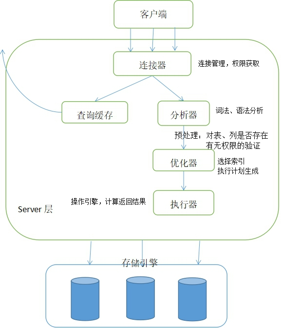

&emsp;作为程序员，除了要精通一门高级编程语言外，还必须熟悉数据库（MySQL/Oracle等）。平常我们只要会写SQL,懂点索引能加速查询,对于初级开发也就够了。但是如果只会输入一条语句，得到输出结果。对MySQL的原理一知半解，那么在发生问题的时候
，就不知道问题出在哪。要想往高级工程师进阶，就得去理解MySQL的内部原理，底层细节。但是我不想这么早就扎入MySQL的源码中。对于我这个初入茅庐的菜鸟程序员，还是在以后的开发中，根据实际问题再去深入研究。这篇笔记主要记录我对MySQL的基础架构的理解，好吧，下面开始。

&emsp;直接贴上MySQL的组件图，那么我们就来讲讲这个图。
### 客户端
首先，客户端就是我们程序员主要工作的地方，你写的Java代码就会调用MySQL提供的Java客户端API。一般客户端开发框架会封装一个连接池，管理复用MySQL的连接。而MySQL可大致分为Server层和存储引擎层两部分。
假设我们执行这样一条SQL,`select * from t where id = 1;`来分析分析它的执行过程，以及各个组件都有什么作用。
### 1.连接器

* 连接管理，每个客户端连接在服务端都会对应与一个线程，连接器同样也是线程池，客户端连接断开了，不会关闭线程，而是等待处理下一个连接；
* 权限验证，将其权限信息读入内存，验证账户和密码的正确性，下面的组件还会用到这部分权限信息。

&emsp;顺带一提查询缓存，根据SQL语句查询是否有缓存，有则直接返回数据。这样看似可以加速查询，但对于读写频繁的业务，你对表上任一行做了更新操作，都会使得该表的缓存失效，假如一条读完下条写，缓存失效，下次又读，又进缓存，这样根本没有提高效率。所以根据业务需求，判断是否需要开启缓存吧，通常建议不使用。

### 2.分析器
* 进行词法分析，语法分析得到语法树，验证语法是否正确，比如根据语法树判断关键字是否正确。
### 3.预处理器
* 此部分根据语法树中解析出的表、列信息，结合前面的权限信息判断用户是否对该表或列具有读/写权限等；
### 4.优化器
* 主要负责优化SQL语句，包括重写查询、决定表的读取顺序，选择合适的索引（估计哪个索引执行快）等，据此生成最优的执行计划。对于上面那条SQL语句，会选择id主键索引。
### 5.执行器
* 根据执行计划给出的指令，调用存储引擎的API,进行计算等。那么这个例子就是调用查询id=1的存储引擎接口。
### 6.存储引擎
* 提供API,比如查询某个索引第一行的接口，查询某个索引条目（数据行）下一个条目的接口。这个例子就是遍历id主键索引树，返回给执行器id=1这一行。
* 存储数据，在内存中提供Buffer Pool,读写磁盘

&emsp;返回结果集，执行器查出数据后，数据由连接器中的当前线程传送回数据，并不是所有数据都查出来了一次性返回给客户端，而是查出数据就可以往连接里传送数据了。

参考资料：  
1. 《高性能MySQL 第三版》章节1.1、6.4  
2. 极客时间《MySQL实战45讲》--丁奇大佬，第一章《基础架构：一条SQL查询语句是如何执行的？》