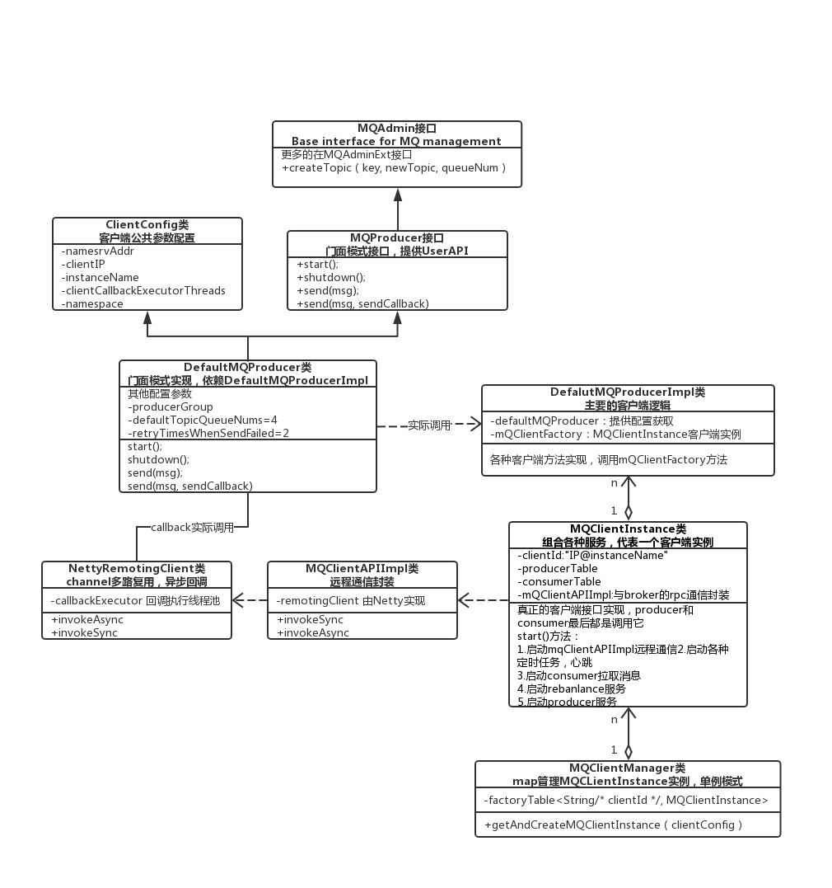
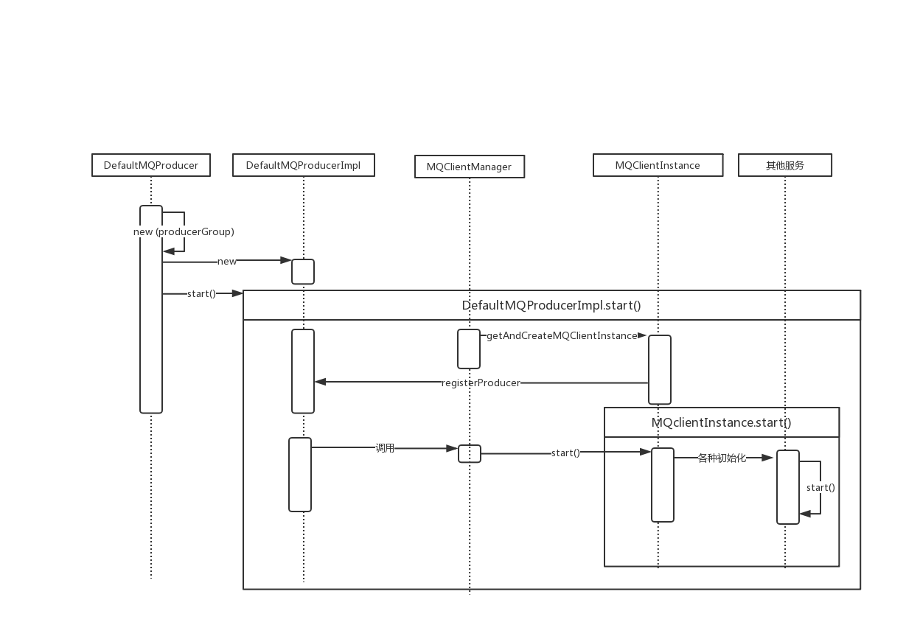

&emsp;最近在学习消息中间件，最后选择了RocketMQ来学习和应用。因为RocketMQ作为阿里开源出来的消息中间件（支持国产），经受了双11和各种大促活动的考验，是一个高可用，可扩展的成熟MQ。另外一点是它是JAVA语言写的，我是Java程序员，如果需要修改源码，那么学习成本也低很多。
毕竟其他消息中间件大多都是其他语言写的，不好研究源码。事实证明，即使是我这样只有1年工作经验的菜鸟，也能看懂它的代码，从中学到点东西。
&emsp;在看了官方文档的Quick Start,几个example后，发现客户端API很简单。发布订阅模型和消息队列模型；普通消息，有序消息，事务消息；集群消费，广播消费；异步处理，系统解耦，流量削峰；producer同步/异步发送，broker同步或异步刷盘，master-slave复制等保障high-availible,
不管是producer,nameserver,broker还是consumer都可以水平扩容。以RocketMQ的源码来学习分布式集群、高可用、可扩展的中间件应该是不错的选择。如果我上面提到的这些概念不清楚的话，建议去看官方文档，以及RocketMQ3.+的相关文档；

* RocketMQ官方文档 http://rocketmq.apache.org/docs/quick-start/
* RocketMQ3原理简介 http://gd-rus-public.cn-hangzhou.oss-pub.aliyun-inc.com/attachment/201604/08/20160408165024/RocketMQ_design.pdf
* RocketMQ3用户指南 http://gd-rus-public.cn-hangzhou.oss-pub.aliyun-inc.com/attachment/201604/08/20160408164726/RocketMQ_userguide.pdf

&emsp;对于如何看源码，无非是将源码clone下来，查看源码中的单元测试，从单元测试入手，打断点，根据代码逻辑，画出类图，时序图，流程图等来帮助理解。不然看了等于没看。
刚开始看的时候不要过多陷入细节，能够明白主要的流程，主要的功能点在什么地方和有哪些设计上的亮点等。源码版本4.5.2。

&emsp;查看client模块中DefaultMQProducerTest测试类，里面有很多测试方法,如下所示

* init()  
* terminate()  
* testSendMessage_ZeroMessage()  
* testSendMessage_NoNameSrv()  
* testSendMessage_NoRoute()  
* testSendMessageSync_Success()  
* testSendMessageSync_WithBodyCompressed()  
* testSendMessageAsync_Success()  
* testSendMessageAsync()  
* testSendMessageAsync_BodyCompressed()  
* testSendMessageSync_SuccessWithHook()  
* testSetCallbackExecutor()  

&emsp;init()方法是其他测试的方法基础，要先初始化一个producer出来，所以，就先分析Producer的参数设置，和start()过程。通过这个过程，来了解客户端各个类之间的关系以及启动了什么服务。主要的类关系如下图所示：

&emsp;首先查看DefaultMQProducer类，它实现了MQProducer用户API接口，继承了ClientConfig客户端公共参数配置类，除了继承公共配置，DefaultMQProducer还自己定义了其他配置如

* producerGroup 生产者组名称  
* defaultTopicQueueNums 默认的主题有多少个队列  
* sendMsgTimeout 发送消息超时  
* compressMsgBodyOverHowmuch 消息压缩  
* retryTimesWhenSendFailed 同步发送失败重试次数  
* retryTimesWhenSendAsyncFailed 异步发送失败重试次数  
* retryAnotherBrokerWhenNotStoreOK broker存储失败尝试另一个broker  
* maxMessageSize 最大消息大小  

&emsp这里的DefaultMQProducer应该是门面模式的思想，向用户 隐藏具体实现的细节，让用户看到的就是一个简单的接口，你会看到DefaultMQProducer里就是调用相应DefaultMQProducerImpl的方法，
，后面各个组件的配合实现都隐藏掉。就像你去咖啡店点一杯咖啡，你只需要告诉营业员要一杯咖啡，咖啡的研磨，冲泡，然后再服务员端上来的过程你都不需要了解并参与。但是DefaultMQProducer继承公共配置类并且自身也加了其他配置参数这样的实现方式我感觉不是很优雅，应该将配置类完全抽离出去，由一个类来统一管理。像Mybatis的Configuration和Spring的Environment等。在后面的DefaultMQProducerImpl中又引用了defaultMQProducer，但实际上大多数只是把它当做获取配置的接口而已，所以这样会有点让人困惑。

接下来看DefaultMQProducerImpl类，它是客户端Producer主要的实现逻辑,debug到start()方法，看到里面是根据状态，执行不同的代码。我们现在处于CREATE_JUST状态，在这里面初始化mQClientFactory（MQClientInstance类实例），通过MQClinetManager的单例中的factoryTable（ConcurrentMap<String/* clientId */, MQClientInstance>）来管理MQClientInstance，这样就不会重复创建相同的MQClientInstance，有点类似于Spring的BeanFactory。clientId = IP@instanceName,所以这里只要定义不同的instanceName就可以在一个Java进程中开启多个MQClientInstance。创建完MQClientInstance后，调用MQClinetInstance.registerProducer（producerGourp,producerImpl）注册producerImpl,进入这个方法，原来MQClientInstance使用ConcurrentMap<String/* group */, MQProducerInner>来管理DefaultMQProducerImpl(实现了MQProducerInner),大概浏览其他属性，发现还管理了consumer和adminExt。所以这时就可以明白MQClientInstance是客户端的真正实现，管理producer,consumer,各种service。注册完后，继续向下debug,到mQClientFactory.start(),这里面的初始化，也是不同状态的switch。这个方法里初始化了很多服务，如mQClientAPIImpl（由netty实现，远程命令实现），startScheduledTask（）启动各种定时任务（如定时从nameServer获取topic路由，与broker的心跳等），pullMessageService，rebalanceService等服务。到了这里整个start过程就基本结束了，producer就开始运行了。看文字描述可能有点混乱，还是画个时序图吧，如下图所示，可能图画的也不标准....

&emsp;总之呢，看完整个初始化过程，你会对客户端的类关系有个大概了解，有些什么服务，看到最后是由NettyRemotingClient实现的与服务器的通信，看来又要去了解一个新的开源框架了Netty了。当然具体每个服务是怎么实现的，以后又需要再继续研究吧。