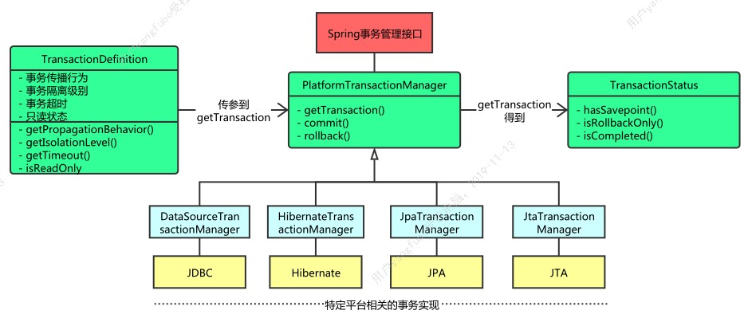
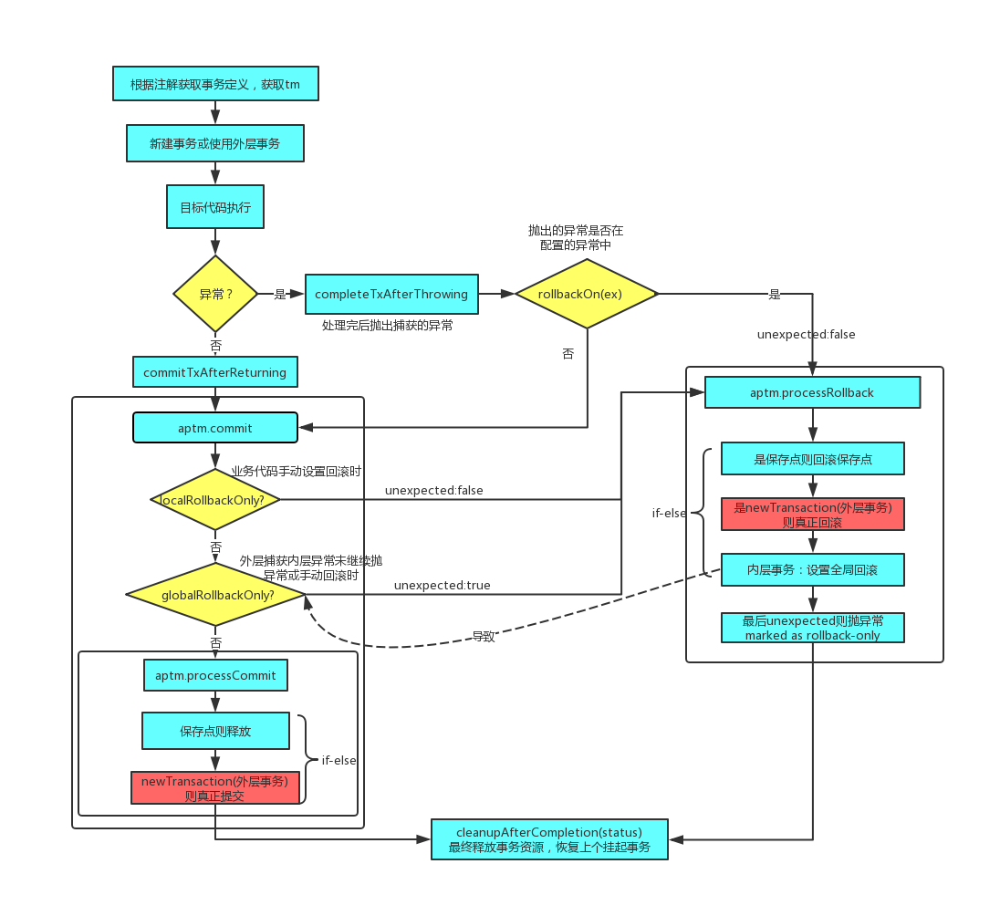

  事务是大家非常熟悉的，后端开发必须得理解事务原理，而作为Java开发，Spring框架也是必须熟悉的，那么Spring是如何表示事务，如何管理事务的呢？那就是这篇文章需要搞清楚的。

## 事务的ACID特性  

* 原子性 Atomicity

  要么全部执行成功，要么全部失败。

* 一致性 Consistency

  假设A,B之间转账，他们的总和是不变的。这种状态是一致的。

* 隔离性 Isolation

  事务之间相互隔离，防止脏读，不可重复读，幻读等问题。

* 持久性 Durability

  事务一旦提交，那么执行结果就持久化了，即使这时数据库崩溃，也可以恢复数据。

## 事务隔离级别

* 读未提交 read uncommited
* 读已提交 read commited 简称RC
* 可重复读 repeatable read 简称RR
* 序列化 serializable

**标准SQL的事务隔离级别**

| 事务隔离级别 | 脏读 | 不可重复读 | 幻读 |  
|  ---- | ----  | ----  | ----  |  
|  读未提交 | 是 | 是  | 是  |  
|  读已提交 | 否 | 是  | 是  |  
|  可重复读 | 否 | 否  | 是  |  
|  序列化 | 否 | 否  | 否  |

**MySQL的事务隔离级别**  

| 事务隔离级别 | 脏读 | 不可重复读 | 幻读 |  
|  ---- | ----  | ----  | ----  |  
|  读未提交 | 是 | 是  | 是  |  
|  读已提交 | 否 | 是  | 是  |  
|  可重复读 | 否 | 否  | 否  |  
|  序列化 | 否 | 否  | 否  |  

  MySQL的事务隔离级别与标准SQL有点不同，在可重复读隔离级别下，它也能防止幻读。它是通过MVCC防止脏读，不可重复读，gap间隙锁防止幻读，详情可以去了解多版本并发控制MVCC与加锁机制。

## 事务相关MySQL命令 

* 关闭自动提交

  set autocommit = 0;  

* 设置只读事务

  set transaction read only;  

* 开启事务 begin

  开启事务，还可以start transaction;还有start transaction with consistent snapshot;开启事务并创建一致性视图（只在可重复读隔离级别下），详细可去了解MySQL的多版本并发控制MVCC。
  
* 提交 commit

  当事务中的sql全部执行成功后，便可commit;此处可以去了解redo log与binlog的“两阶段提交”过程。

* 回滚 rollback

  当执行出错，或业务逻辑出错，事务需要回滚。此处可以去了解undo log回滚日志。

## Spring事务抽象 

首先，我们来看下它主要的接口和类,主要有
`TransactionDefinition,TransactionStatus,PlatformTransactionManager,TransactionInterceptor,TransactionSynchronizationManager,TransactionInfo(definition+status+tm)`等等。



* **TransactionDefinition 事务定义**  


```

	public interface TransactionDefinition {
	
	    // 若当前线程不存在事务中, 则开启一个事务, 若当前存在事务, 则加入其中
	    int PROPAGATION_REQUIRED = 0;
	
	    // 若当前存在事务, 则加入到事务中, 若不存在, 则以非事务的方式运行
	    int PROPAGATION_SUPPORTS = 1;
	
	    // 若有事务, 则用当前的事务, 若没有, 则直接抛出异常
	    int PROPAGATION_MANDATORY = 2;
	
	    // 若当前存在事务, 则挂起事务, 若当前不存在事务, 则开启一个新事务运行
	    int PROPAGATION_REQUIRES_NEW = 3;
	
	    // 不支持以事务的方式运行, 若当前存在事务, 则将当前的事务挂起
	    int PROPAGATION_NOT_SUPPORTED = 4;
	
	    // 不支持事务, 若当前线程含有事务, 则直接抛出异常
	    int PROPAGATION_NEVER = 5;
	
	    // 这个时在原来的事务中通过 savepoint 的方式 开启一个局部事务
	    int PROPAGATION_NESTED = 6;
	
	    // 默认隔离级别
	    int ISOLATION_DEFAULT = -1;
	
	    // read_uncommitted 读未提交级别
	    int ISOLATION_READ_UNCOMMITTED = Connection.TRANSACTION_READ_UNCOMMITTED;
	
	    // READ_COMMITTED 读已提交级别
	    int ISOLATION_READ_COMMITTED = Connection.TRANSACTION_READ_COMMITTED;
	
	    // REPEATABLE_READ 可重复读级别
	    int ISOLATION_REPEATABLE_READ = Connection.TRANSACTION_REPEATABLE_READ;
	
	    // SERIALIZABLE 序列化级别
	    int ISOLATION_SERIALIZABLE = Connection.TRANSACTION_SERIALIZABLE;
	
	    // 默认超时时间
	    int TIMEOUT_DEFAULT = -1;
	
	    // 获取传播行为
	    int getPropagationBehavior();
	
	    //  获取隔离级别
	    int getIsolationLevel();
	
	    // 获取超时时间
	    int getTimeout();
	
	    // 事务是否是只读模式
	    boolean isReadOnly();
	
	    // 返回事务的名字
	    String getName();
	}

```

DefaultTransactionDefinition的属性：传播行为，隔离级别，超时回滚，只读事务，事务名称  

```
	// 传播行为
	private int propagationBehavior = PROPAGATION_REQUIRED;
	// 隔离级别
	private int isolationLevel = ISOLATION_DEFAULT;
	// 超时回滚
	private int timeout = TIMEOUT_DEFAULT;
	// 只读事务
	private boolean readOnly = false;
	// 事务名称
	private String name;

```

@Transactional注解就包含这些配置,在事务拦截器中会解析为definition,下面源码分析时就会看到。


* **TransactionStatus 事务状态**

事务状态维护这一个事务开始到结束的一些状态，在默认的实现类DefaultTransactionStatus中包含比如事务对象（包含连接），是否已完成，回滚标志，保存点，挂起事务等信息。

DefaultTransactionStatus的属性：  
```

	// 事务连接器, 比如 DataSourceTransactionManager 中的 DataSourceTransactionObject
	private final Object transaction;
	// 是否是新事务
	private final boolean newTransaction;
	// 是否开启 事务同步器 <- 其实就是在 TransactionSynchronousManager 中注册属性信息
	private final boolean newSynchronization;
	// 这个事务是否是 readOnly
	private final boolean readOnly;
	//  suspend 的上个事务的信息, suspendedResources 可能是 null
	private final Object suspendedResources;

	// -------AbstractTransactionStatus-------
	// 是否只能回滚
	private boolean rollbackOnly = false;
	// 是否已完成
	private boolean completed = false;
	// savepoint保存点
	private Object savepoint;

```

* **PlatformTransactionManager 平台事务管理器**

```

	public interface PlatformTransactionManager {
		// 获取事务
		TransactionStatus getTransaction(TransactionDefinition definition) throws TransactionException;
		// 提交
		void commit(TransactionStatus status) throws TransactionException;
		// 回滚
		void rollback(TransactionStatus status) throws TransactionException;
	} 

```

有多个实现类，一般都是使用基于数据源DataSource的DataSourceTransactionManager。

* TransactionInfo 事务信息封装

```

	protected final class TransactionInfo {
	
			// 事务管理器
			private final PlatformTransactionManager transactionManager;
	
			// 事务定义definition
			private final TransactionAttribute transactionAttribute;
			
			// 类名+方法名
			private final String joinpointIdentification;
	
			// 事务状态
			private TransactionStatus transactionStatus;
	
			// 老事务，可能为空
			private TransactionInfo oldTransactionInfo;
	}

```

成功开启一个事务后，会将status和definition封装成txInfo并线程隔离保存在`TransactionAspectSupport:ThreadLocal<TransactionInfo> transactionInfoHolder;`

## 声明式事务

  Spring提供了两种事务使用方式，编程式事务和声明式事务，一般我们使用基于注解的AOP实现---声明式事务，即@Transactional注解的方法或类会被代理。AOP与业务代码无侵入，只需要关心业务实现逻辑上，不用咱们手动开始，回滚事务。下面将进行详细的原理源码分析，贴上来的代码是我选择重要逻辑，精简的，并加上中文注释说明。

## TransactionInterceptor源码分析

TransactionIntercepter事务拦截，继承了TransactionAspectSupport,就是一个around的增强，主要逻辑在方法invokeWithinTransaction中。

### invokeWithinTransaction方法

获取事务定义属性txAttr，事务管理器tm,创建事务，执行目标方法，如果抛出异常则进行异常处理（回滚或提交），否则进行提交处理（提交或回滚）

```java
	
	protected Object invokeWithinTransaction(Method method, @Nullable Class<?> targetClass,
				final InvocationCallback invocation) throws Throwable {
	
			// If the transaction attribute is null, the method is non-transactional.
			// @Transactional注解转换成TransactionAttribute（继承TransactionDefinition）
			// 获取到AnnotationTransactionAttributeSource：通过获取方法上的注解信息来获知 事务的属性, 解析主要由 SpringTransactionAnnotationParser 来进行
			TransactionAttributeSource tas = getTransactionAttributeSource();
			final TransactionAttribute txAttr = (tas != null ? tas.getTransactionAttribute(method, targetClass) : null);
			// 获取@Transactional中配置的transactionManager属性获取对应的beanName的对象或者设置的默认事务管理器， 都通过beanFactory获取，beanName或类型
			final PlatformTransactionManager tm = determineTransactionManager(txAttr);
			final String joinpointIdentification = methodIdentification(method, targetClass, txAttr);
	
			/**
		     * 这里区分不同类型的 PlatformTransactionManager 因为它们的调用方式不同
		     * 对 CallbackPreferringPlatformTransactionManager 来说, 需要回调函数来
		     * 实现事务的创建和提交
		     * 对于非 CallbackPreferringPlatformTransactionManager 来说, 不需要通过
		     * 回调函数来实现事务的创建和提交
		     * 像 DataSourceTransactionManager 就不是 CallbackPreferringPlatformTransactionManager
		     * 不需要通过回调的方式来使用
		     */
			if (txAttr == null || !(tm instanceof CallbackPreferringPlatformTransactionManager)) {
				// Standard transaction demarcation with getTransaction and commit/rollback calls.
				// 如果必要创建事务（因为此时可能是嵌套事务，则会使用已存在的事务）
				TransactionInfo txInfo = createTransactionIfNecessary(tm, txAttr, joinpointIdentification);
				Object retVal = null;
				try {
					// This is an around advice: Invoke the next interceptor in the chain.
					// This will normally result in a target object being invoked.
					// 目标方法调用,沿着拦截器链进行下去
					retVal = invocation.proceedWithInvocation();
				}
				catch (Throwable ex) {
					// target invocation exception
					// 异常回滚，rollback操作，如果此异常不回滚，则提交（@transactional的rollbackFor配置需要回滚的异常）
					completeTransactionAfterThrowing(txInfo, ex);
					throw ex;
				}
				finally {
					// 与线程绑定的TransactionInfo 设置为 oldTransactionInfo
					cleanupTransactionInfo(txInfo);
				}
				// 无异常，如果不是rollbackOnly,则commit操作，
				commitTransactionAfterReturning(txInfo);
				return retVal;
			}
			else{
				// CallbackPreferringPlatformTransactionManager 
			}
	}

```


### 创建事务createTransactionIfNecessary

获取连接，并将事务定义和状态封装到TransactionInfo，通过TransactionAspectSupport绑定到线程

```

	protected TransactionInfo createTransactionIfNecessary(@Nullable PlatformTransactionManager tm,
			@Nullable TransactionAttribute txAttr, final String joinpointIdentification) {

		TransactionStatus status = null;
		if (txAttr != null) {
			if (tm != null) {
				// PlatformTransactionManager接口调用,实际调用AbstractPlatformTransactionManager.getTransaction,它里面是策略模式和模板方法设计模式的运用
				status = tm.getTransaction(txAttr);
			}
		}
		// 将definition和status封装到transactionInfo并绑定到线程中 TransactionAspectSupport: ThreadLocal<TransactionInfo> transactionInfoHolder
		return prepareTransactionInfo(tm, txAttr, joinpointIdentification, status);
	}

```

### 事务连接获取tm.getTransaction

主要包含获取连接，将连接和其他事务信息通过事务同步器TransactionSynchronizationManager绑定到线程

```

	public final TransactionStatus getTransaction(@Nullable TransactionDefinition definition) throws TransactionException {
		// 获取事务，由子类实现，模板方法
		Object transaction = doGetTransaction();

		// 如果已经存在事务
		if (isExistingTransaction(transaction)) {
			// Existing transaction found -> check propagation behavior to find out how to behave.
			// 方法内根据传播行为不同，执行不同的逻辑（策略模式），如果是required_new ,则是新建事务连接;如果是nested,则是使用savePoint
			return handleExistingTransaction(definition, transaction, debugEnabled);
		}

		
		// No existing transaction found -> check propagation behavior to find out how to proceed.
		if (definition.getPropagationBehavior() == TransactionDefinition.PROPAGATION_MANDATORY) {
			throw new IllegalTransactionStateException(
					"No existing transaction found for transaction marked with propagation 'mandatory'");
		}
		// 不存在事务
		else if (definition.getPropagationBehavior() == TransactionDefinition.PROPAGATION_REQUIRED ||
				definition.getPropagationBehavior() == TransactionDefinition.PROPAGATION_REQUIRES_NEW ||
				definition.getPropagationBehavior() == TransactionDefinition.PROPAGATION_NESTED) {
			// 传播行为是required/requires_new/nested则会新建事务（策略模式），默认配置是PROPAGATION_REQUIRED
			SuspendedResourcesHolder suspendedResources = suspend(null);
			try {
				boolean newSynchronization = (getTransactionSynchronization() != SYNCHRONIZATION_NEVER);
				// 创建事务状态
				DefaultTransactionStatus status = newTransactionStatus(
						definition, transaction, true, newSynchronization, debugEnabled, suspendedResources);
				// 创建事务连接，dataSource.getConnection，连接保存到TransactionSynchronizationManager线程同步管理器的ThreadLocal<Map<DataSource,>>
				doBegin(transaction, definition);
				// 将事务的一些属性绑定到线程，TransactionSynchronizationManager线程同步管理器，内部有许多ThreadLocal保存信息，如事务连接资源，readOnly是否只读等
				// MyBatis会在获取事务连接时中通过TransactionSynchronizationManager获取，MyBatis源码入口SpringManagedTransactionFactory
				prepareSynchronization(status, definition);
				return status;
			}
			catch (RuntimeException | Error ex) {
				resume(null, suspendedResources);
				throw ex;
			}
		}
		else {
			// Create "empty" transaction: no actual transaction, but potentially synchronization.
			if (definition.getIsolationLevel() != TransactionDefinition.ISOLATION_DEFAULT && logger.isWarnEnabled()) {
				logger.warn("Custom isolation level specified but no actual transaction initiated; " +
						"isolation level will effectively be ignored: " + definition);
			}
			boolean newSynchronization = (getTransactionSynchronization() == SYNCHRONIZATION_ALWAYS);
			return prepareTransactionStatus(definition, null, true, newSynchronization, debugEnabled, null);
		}
	}


```

### 提交或回滚

提交回滚的逻辑比较复杂，事务有嵌套关系，整个过程事务状态的转变有点复杂，比较难debug，我尽可能得按自己的理解画出了事务的过程，可能有错误欢迎指正，
在后续的学习，应用过程中再继续修订。注：内外层事务使用的是required传播行为（有事务则用外层事务，无事务则新建）。



再回忆下事务处理的一个大概流程，如下伪代码：

```

	protected Object invokeWithinTransaction(method,targetClass,invocation) throws Throwable {

		// 获取事务定义，事务管理器tm
		// 创建事务
		createTransactionIfNecessary;
		try{
			// 调用目标方法
			retVal = invocation.proceed;
		}catch(ex){
			// 方法内根据配置的回滚异常决定是提交还是回滚
			completeTransactionAfterThrowing(txInfo, ex);
			throw ex;
		}
		// 无异常，提交，但也会根据手动回滚设置的/内层事务回滚设置的rollbackOnly进行回滚
		commitTransactionAfterReturning(txInfo);
		return retVal;
	}

```

提交或回滚代码中一般都是commit->processCommit-doCommit,rollback->processRollback->doRollback

* **无异常，事务提交**


```

	public final void commit(TransactionStatus status) throws TransactionException {
		
		DefaultTransactionStatus defStatus = (DefaultTransactionStatus) status;
		if (defStatus.isLocalRollbackOnly()) {
			if (defStatus.isDebug()) {
				logger.debug("Transactional code has requested rollback");
			}
			// 业务代码中手动设置回滚时 TransactionAspectSupport.currentTransactionStauts().setRollbackOnly();
			processRollback(defStatus, false);
			return;
		}

		if (!shouldCommitOnGlobalRollbackOnly() && defStatus.isGlobalRollbackOnly()) {
			if (defStatus.isDebug()) {
				logger.debug("Global transaction is marked as rollback-only but transactional code requested commit");
			}
			// 内层事务异常（设置了rollbackOnly）但在主事务中被catch了，未继续抛出异常或手动设置回滚
			processRollback(defStatus, true);
			return;
		}
		// 处理提交
		processCommit(defStatus);
	}


	private void processCommit(DefaultTransactionStatus status) throws TransactionException {
		try {
			boolean beforeCompletionInvoked = false;

			try {
				boolean unexpectedRollback = false;
				// 一些事务提交前的触发器调用
				prepareForCommit(status);
				triggerBeforeCommit(status);
				triggerBeforeCompletion(status);
				beforeCompletionInvoked = true;

				if (status.hasSavepoint()) {
					if (status.isDebug()) {
						logger.debug("Releasing transaction savepoint");
					}
					unexpectedRollback = status.isGlobalRollbackOnly();
					// 释放保存点
					status.releaseHeldSavepoint();
				}
				else if (status.isNewTransaction()) {
					if (status.isDebug()) {
						logger.debug("Initiating transaction commit");
					}
					unexpectedRollback = status.isGlobalRollbackOnly();
					// 是外层事务（新事务）,真正提交,connection.commit()
					doCommit(status);
				}
				else if (isFailEarlyOnGlobalRollbackOnly()) {
					unexpectedRollback = status.isGlobalRollbackOnly();
				}

				// Throw UnexpectedRollbackException if we have a global rollback-only
				// marker but still didn't get a corresponding exception from commit.
				if (unexpectedRollback) {
					throw new UnexpectedRollbackException(
							"Transaction silently rolled back because it has been marked as rollback-only");
				}
			}
			// 去除一些catch异常等非主要代码

			// Trigger afterCommit callbacks, with an exception thrown there
			// propagated to callers but the transaction still considered as committed.
			try {
				triggerAfterCommit(status);
			}
			finally {
				triggerAfterCompletion(status, TransactionSynchronization.STATUS_COMMITTED);
			}

		}
		finally {
			// 释放事务资源，恢复上一个挂起的事务等
			cleanupAfterCompletion(status);
		}
	}


```


* **异常，事务回滚**

发生异常情况下，如果是我们配置的异常，则回滚处理，否则调用提交处理。处理回滚如果是外层事务，则真正回滚，如果是内层事务，则是设置rollbackOnly

```

	protected void completeTransactionAfterThrowing(@Nullable TransactionInfo txInfo, Throwable ex) {
		if (txInfo != null && txInfo.getTransactionStatus() != null) {
			
			if (txInfo.transactionAttribute != null && txInfo.transactionAttribute.rollbackOn(ex)) {
			// 在@transactional注解配置的rollbackFor异常 如rollbackFor=Exception.calss
				try {
					txInfo.getTransactionManager().rollback(txInfo.getTransactionStatus());
				}
				// 省略catch
			}
			else {
				// We don't roll back on this exception.
				// Will still roll back if TransactionStatus.isRollbackOnly() is true.
				// 如果里面检查到设置了rollbackOnly还是要回滚
				try {
					txInfo.getTransactionManager().commit(txInfo.getTransactionStatus());
				}
				// 省略catch
			}
		}
	}

	private void processRollback(DefaultTransactionStatus status, boolean unexpected) {
		try {
			boolean unexpectedRollback = unexpected;

			try {
				triggerBeforeCompletion(status);

				if (status.hasSavepoint()) {
					if (status.isDebug()) {
						logger.debug("Rolling back transaction to savepoint");
					}
					// 直接回滚到保存点
					status.rollbackToHeldSavepoint();
				}
				else if (status.isNewTransaction()) {
					if (status.isDebug()) {
						logger.debug("Initiating transaction rollback");
					}
					// 外层事务才真正回滚 connection.rollback()
					doRollback(status);
				}
				else {
					// Participating in larger transaction
					if (status.hasTransaction()) {
						if (status.isLocalRollbackOnly() || isGlobalRollbackOnParticipationFailure()) {
							if (status.isDebug()) {
								logger.debug("Participating transaction failed - marking existing transaction as rollback-only");
							}
							// 内层事务异常，仅仅设置全局回滚
							doSetRollbackOnly(status);
						}
						else {
							if (status.isDebug()) {
								logger.debug("Participating transaction failed - letting transaction originator decide on rollback");
							}
						}
					}
					else {
						logger.debug("Should roll back transaction but cannot - no transaction available");
					}
					// Unexpected rollback only matters here if we're asked to fail early
					if (!isFailEarlyOnGlobalRollbackOnly()) {
						unexpectedRollback = false;
					}
				}
			}
			catch (RuntimeException | Error ex) {
				triggerAfterCompletion(status, TransactionSynchronization.STATUS_UNKNOWN);
				throw ex;
			}

			triggerAfterCompletion(status, TransactionSynchronization.STATUS_ROLLED_BACK);

			// Raise UnexpectedRollbackException if we had a global rollback-only marker
			// unexpected传入为true,外层事务在提交时commitTransactionAfterReturning()发现全局回滚标记为true则调用processRollback(stauts,true),其他情况传入的都是false
			if (unexpectedRollback) {
				throw new UnexpectedRollbackException(
						"Transaction rolled back because it has been marked as rollback-only");
			}
		}
		finally {
			// 释放事务资源，恢复上一个挂起的事务等
			cleanupAfterCompletion(status);
		}
	}

```

* **事务清理动作**

 1.设置事务完成标志  
 2.清理事务同步资源3  
 3.释放事务，连接资源   
 4.恢复挂起事务  

```

	private void cleanupAfterCompletion(DefaultTransactionStatus status) {
		// 1.设置事务完成标志
		status.setCompleted();
		// 2.清理事务同步资源
		if (status.isNewSynchronization()) {
			TransactionSynchronizationManager.clear();
		}
		// 3.清理事务，连接资源
		if (status.isNewTransaction()) {
			doCleanupAfterCompletion(status.getTransaction());
		}
		// 4.回复挂起事务
		if (status.getSuspendedResources() != null) {
			if (status.isDebug()) {
				logger.debug("Resuming suspended transaction after completion of inner transaction");
			}
			resume(status.getTransaction(), (SuspendedResourcesHolder) status.getSuspendedResources());
		}
	}


```

## 示例代码分析

下面的代码默认都采用required传播行为，捕获Exception异常回滚

示例1：捕获内层异常并忽略  
 
不建议这种catch内层事务异常，而不手动回滚或继续抛异常的，这样别人调你接口根本不知道是什么出错了，最好抛出一个说明原因的异常。

```

	// 不建议这种catch内层事务异常，而不手动回滚或继续抛异常的，这样别人调你接口根本不知道是什么出错了，最好抛出一个说明原因的异常。
    // 执行前（"zhangsan",18）
    @Override
    @Transactional(rollbackFor = Exception.class)
    public int innerTxWithExButIgnore(String username, int age) throws Exception {
        userDao.updateAge(username, age);
        // ("zhangsan",20)
        try {
            userDao.updateAgeEx(username,age+1);
            // ("zhangsan",21)
        } catch (Exception e) {
            log.info("innerTxWithExButIgnore.忽略异常");
        }
        // ("zhangsan",21)
        userDao.updateName(username, "test");
        // ("zhangsan","test",21)
        log.info("innerTxWithExButIgnore.ignore更新后：{}",userDao.get(username));
        log.info("innerTxWithExButIgnore.异常后仍执行其他事务");
        // 最终外层事务提交时，会因为全局rollbackOnly回滚所有sql并抛出异常marked as roll-back only
        return 1;
    }
    // 执行后（"zhangsan",18）

```

示例2：捕获内层异常并手动回滚

```

	// 内层事务异常被catch,手动设置回滚还算正确
    // 执行前（"zhangsan",18）
    @Override
    @Transactional(rollbackFor = Exception.class)
    public int innerTxWithExSetRoll(String username, int age) throws Exception {
        userDao.updateAge(username, age);
        // ("zhangsan",20)
        try {
            userDao.updateAgeEx(username,age+1);
            // ("zhangsan",21)
        } catch (Exception e) {
            log.info("innerTxWithExSetRoll.手动设置rollbackOnly");
            TransactionAspectSupport.currentTransactionStatus().setRollbackOnly();
        }
        // ("zhangsan",21)
        return 1;
    }
    // 执行后("zhangsan",18)

```

示例3：捕获内层异常并处理后继续向上抛出此异常（或其他异常）
```

	@Override
    @Transactional(rollbackFor = Exception.class)
    public int innerTxWithExThrowUp(String username, int age) throws Exception {
        userDao.updateAge(username, age);
        // ("zhangsan",20)
        try {
            userDao.updateAgeEx(username,age+1);
            // ("zhangsan",21)
        } catch (Exception e) {
            log.info("innerTxWithExThrowUp.继续向上抛出异常");
            throw e;
        }
        // ("zhangsan",21)
        return 1;
    }

```

示例4：内层事务方法直接调用（内层事务不起作用，因为执行的不是代理后的方法）  

```

	@Transactional(propagation = Propagation.REQUIRES_NEW,rollbackFor = Exception.class)
    public void newTx(String username) throws Exception {
        userDao.updateName(username, "test");
        throw new Exception();
    }

	// 执行前("zhangsan",18)
    @Override
    @Transactional(rollbackFor = Exception.class)
    public void innerTxNotWork(String username, int age) throws Exception {
        userDao.updateAge(username, age);
        // ("zhangsan",20)
        // 因为是直接调用的目标方法，而不是代理后的，所以下面方法不是新事务
        newTxWithEx(username);
        // ("zhangsan","test",20)
        //((UserService) (AopContext.currentProxy())).newTxWithEx(username);正确用法
    }
    // 执行后 ("zhangsan",18)


```

## 总结

到这里应该算是把Spring事务抽象及管理机制和源码实现分析的差不多了，事务隔离级别（主要读已提交和可重复读），事务传播行为（主要required,requires_new,nested,要分清他们的区别），主要涉及的类包括TransactionDefinition,TransactionStatus,PlatformTransactionManager和将三者封装的TransactionInfo以及线程隔离的事务同步信息管理器TransactionSynchronizationManager，手动回滚的TransactionAspectSupport，和基于注解@Transactional的声明式事务拦截器TransactionInterceptor  

Spring这边的事务理解了，接下来就要去理解比如连接池DataSource，MyBatis的原理源码，再深层点，去理解MySQL的事务实现机制，MVCC，锁，索引等原理。将它们串起来理解，对CRUD的整体理解和深层理解都将是质的飞越，只有将基础打牢，上层建筑才能建设起来，排查问题，问题定位与性能优化等才能游刃有余，我相信随着开发年限，经验的增长，成为技术大牛指日可待。