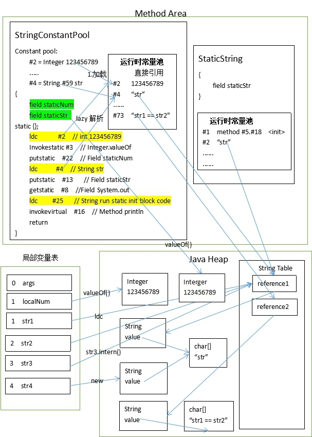

### 傻傻分不清楚
&emsp;在看《深入理解Java虚拟机》的时候，在前面的内存结构章节中，方法区中有运行时常量池，在学class文件结构的时候，又发现有class文件常量池，然后呢，还有个全局的字符串常量池（String table）。在网上搜索他们的区别，也很少有能够讲的清楚的。当然，也并不是说我就讲的清楚了。我也只是把我自己的理解用文字记录下来。以便以后还是傻傻分不清。下面将会按照他们产生的顺序开始介绍。

### class文件常量池(Constant Pool Table)
&emsp;将源代码编译成class文件后，通过javap -v -p classfile 反解析出我们能看懂的字节码（你要是能看懂二进制当我没说）。你会看到，class文件里一开头就有很大一部分是Constant Pool。里面包含了各种字面量（Literal）和符号引用(Symbal References)。字面量和Java中的常量比较接近，如文本字符串、声明为final的常量值等，符号引用包括类和接口的全限定名，方法的名称和描述符，字段的名称和描述符。

&emsp;Java代码在javac编译的时候，不像C/C++那样有连接这一步骤，而是在虚拟机加载class文件的时候进行动态连接。也就是说，在Class文件中不会保存各个方法、字段的最终内存布局信息，因此这些字段、方法的符号引用不经过运行时转换的话无法得到真正的内存入口地址（字段可以理解为字段的地址，方法为入口地址）。当虚拟机运行时，需要从class文件常量池获得对应的符号引用，再在类创建时或运行时解析、翻译到具体的内存地址中。这部分知识可以去了解类的加载过程。常量池里的内容具体是怎么定义的可以去看class文件结构的class文件常量池文章。


<center>class文件常量池常量项结构.png</center>


### 运行时常量池（Runtime Constant Pool）
&emsp;前面我们已经知道class文件常量池是存放字面量和符号引用的了。那么运行时常量池是什么呢？
&emsp;JVM在执行某个类的时候，会经过类的加载机制，将其加载，连接（验证、准备、解析），初始化。那么当类被加载到内存后，JVM就会将class文件常量池里的字面量和符号引用加载进运行时常量池，而且运行时常量池是一个类对应其自己的运行时常量池。在解析阶段可以将符号引用解析为直接引用（包括类或接口、字段、类方法、接口方法，invokeDynamic相关的符号引用），但存在Lazy的情况，虚拟机规范没有规定解析阶段发生的具体时间，只要求在执行`anewarray,multianewarray,checkcast,new,getfield,getstatic,putfield,putstatic,instanceof,invokedynamic,invokeinterface,invokespecial,invokestatic,invokevirtual,ldc.ldc_w`这16个用于操作符号引用的字节码指令之前，先对他们进行符号引用。从反解析出的字节码中可以看到，方法的调用比如invokevirtual后面会有符号引用在class文件常量池的索引。那么运行时就是拿这个符号引用的索引，去运行时常量池中获取解析后的直接引用。

### 字符串常量池（String Table）
&emsp;字符串常量池，在JDK1.7将其从永久代移动到了java堆。它是全局共享的，所以也叫全局字符串常量池。如下代码在JDK1.6和JDK1.7中的OOM区域不同。

```java
	
	static String str = "test";
	public static void main(String[] args){
		List<String> list = new LinkedList<>();
		while(true){
			str = str+str;
			list.add(str.intern());
		}
	}
```

* JDK1.6中是OutOfMemoryError: PermGen space
* JDK1.7及以上是OutOfMemoryError: Java heap space

&emsp;全局字符串常量池可以理解为一个HashSet<String>,**里面存储的是String对象的引用**,牢记是引用。真正的字符串其实是String类里的char[] value存储的字符数组。因为数组是引用类型，所以应该在java堆中存储着诸如"abc"=['a','b','c']这样的数据。那么，是什么时候字符串字面量会加载进全局字符串常量池呢？下面我们就结合源代码、字节码、类加载、JVM内存结构，画个图来分析一波。源代码和字节码由于太多，我就完整地贴到笔记的最后面了。


<center>3个常量池的关系图</center>

&emsp;以上是我理解的3者的关系，首先经过类加载，在初始化阶段会调用类的初始化器<clinit>对应于字节码中的static{}代码块(它会将静态属性或静态代码块在源码中的先后顺序进行组合到一个方法内)。
&emsp;静态初始化方法内有ldc字节码指令（load constant?），这个指令的作用是：根据class文件常量池中的索引号（如下方的#2），去运行时常量池中寻找对应的常量，如果没有解析，则解析，将直接引用存入运行时常量池（以后就不用解析了），如果是整形则是把int值压入操作数栈供后面的Interge.valueOf(int)调用。如果是字符串，则会去全局字符串常量池中查找是否存在（类似equals）,存在则直接返回全局字符串常量池中的引用，不存在则在堆中创建一个String对象，把引用存入全局字符串常量池并返回其引用压入栈顶。

&emsp;class常量池中的常量加载到运行时常量池中，对它的解析resolve是lazy的。只有遇到ldc指令的时候才会去判断是否解析，没解析则解析。示例代码因为类加载最后是初始化，类静态属性的初始化赋值就会执行ldc指令，所以类加载完staticStr就已经解析了。但是如果是main方法中“str1 == str2”这样的字面量，只有在第一次运行到ldc命令的时候去真正解析。

```java
	
	... ...

	Constant pool:
	   #1 = Methodref          #27.#57       // java/lang/Object."<init>":()V 对象默认无参初始化构造器
       #2 = Integer            123456789     // 整形字面量
       #3 = Methodref          #58.#59       // java/lang/Integer.valueOf:(I)Ljava/lang/Integer;  方法引用
       #4 = String             #60           // str  字符串字面量
	... ...

	static {}; //类初始化构造器<clinit>
	    descriptor: ()V
	    flags: ACC_STATIC
	    Code:
	      stack=2, locals=0, args_size=0
	         0: ldc           #2                  // int 123456789  从运行时常量池中获取int值并压入栈顶
	         2: invokestatic  #3                  // Method java/lang/Integer.valueOf:(I)Ljava/lang/Integer; 
	         5: putstatic     #22                 // Field staticNum:Ljava/lang/Integer;
	         8: ldc           #4                  // String str  从运行时常量池中获取直接引用并压入栈顶,获取过程中如果没解析过，会去全局字符串常量池中查找是否已驻留，无则在堆中新建String对象，其引用存入全局字符串常量池，并返回其引用
	        10: putstatic     #13                 // Field staticStr:Ljava/lang/String;  给staticStr静态属性赋值
	        13: getstatic     #8                  // Field java/lang/System.out:Ljava/io/PrintStream;
	        16: ldc           #25                 // String run static init block code\n
	        18: invokevirtual #16                 // Method java/io/PrintStream.println:(Ljava/lang/String;)V
	        21: return	

```

&emsp;重新整理下"str"这个字面量从class文件到main方法运行时的过程，类加载的加载阶段“str”从class文件常量池加载进运行时常量池，并在类初始化阶段(最先打印"run static init block code")执行生成的初始化方法中第一次执行ldc命令，ldc命令检查到该字面量未解析，去全局字符串常量池中查找，也无对应引用，所以在堆中创建String对象，将其引用存入全局字符串常量池，返回这个引用，ldc命令将之加载到操作数栈顶，后面的putstatic将这个引用赋值给类静态属性staticStr；
然后main方法里，另一个StaticString.str也是类初始化阶段执行ldc命令，运行时常量池中没解析，不过它在全局字符串常量池中发现有引用（StringConstantPool生成的），直接返回该引用，所以他们两个==为true;str1这个局部变量也使用ldc指令去本类运行时常量池中将字符串载入栈顶，发现已解析，返回直接引用压入栈顶；str2同理；str3调用构造器，查看源码发现，其实是将String对象的value属性赋值给新String对象；str4调用str3.intern(),该方法去全局字符串常量池中查找是否有等于str3（equals）的引用，发现有（前面类属性staticStr通过ldc产生的），返回全局字符串常量池中的引用。

&emsp;讲到这里，你已经基本掌握了class文件常量池、运行时常量池、全局字符串常量池中字符串的关系。但是其实还有JIT及时编译器优化（逃逸分析，栈上分配，标量替换，方法内联等）。不想再陷入过多的细节了，有兴趣的详细参考R大的文章https://www.iteye.com/blog/rednaxelafx-774673

本篇笔记参考的资料有：  
1.《深入理解Java虚拟机》  
2.https://www.zhihu.com/question/55994121/answer/147296098  
3.https://www.iteye.com/blog/rednaxelafx-774673

示例源码：

```java

	public class StringConstantsPool {
	
	    public static Integer staticNum = 123456789;
	
	    public static String staticStr = "str";
	
	    static {
	        System.out.println("run static init block code\n");
	    }
	    public static void main(String[] args) {
	        Integer localNum = 123456789;
	        String str1 = "str";
	        String str2 = "str";
	        String str3 = new String("str");
	        String str4 = str3.intern();
	        System.out.println("static final str == str1 :" + (staticStr == str1));
	        System.out.println("str1 == str2 : " + (str1 == str2));
	        System.out.println("str1 == str3 : " + (str1 == str3));
	        System.out.println("str4 == str1 : " + (str4 == str1));
	        System.out.println("str4 == str3 : " + (str4 == str3));
	        System.out.println("staticNum == localNum : " + (staticNum == localNum));
	        System.out.println("StringConstantsPool.staticStr == StaticString.staticStr : " + (StringConstantsPool.staticStr == StaticString.staticStr));
	    }
	}


	public  class StaticString {
	    public static  String staticStr = "str";
	}

```

示例字节码：  javap - v -p clasfile

```java

	Classfile /D:/WorkSpace/JavaPractice/target/classes/practice/bytecode/stringConstantsPool/StringConstantsPool.class
	  Last modified 2019-9-26; size 2313 bytes
	  MD5 checksum 5e0b6d05c2e567f5bbada19684e73854
	  Compiled from "StringConstantsPool.java"
	public class practice.bytecode.stringConstantsPool.StringConstantsPool
	  minor version: 0
	  major version: 52
	  flags: ACC_PUBLIC, ACC_SUPER
	Constant pool:
	    #1 = Methodref          #27.#57       // java/lang/Object."<init>":()V
	    #2 = Integer            123456789
	    #3 = Methodref          #58.#59       // java/lang/Integer.valueOf:(I)Ljava/lang/Integer;
	    #4 = String             #60           // str
	    #5 = Class              #61           // java/lang/String
	    #6 = Methodref          #5.#62        // java/lang/String."<init>":(Ljava/lang/String;)V
	    #7 = Methodref          #5.#63        // java/lang/String.intern:()Ljava/lang/String;
	    #8 = Fieldref           #64.#65       // java/lang/System.out:Ljava/io/PrintStream;
	    #9 = Class              #66           // java/lang/StringBuilder
	   #10 = Methodref          #9.#57        // java/lang/StringBuilder."<init>":()V
	   #11 = String             #67           // static final str == str1 :
	   #12 = Methodref          #9.#68        // java/lang/StringBuilder.append:(Ljava/lang/String;)Ljava/lang/StringBuilder;
	   #13 = Fieldref           #26.#69       // practice/bytecode/stringConstantsPool/StringConstantsPool.staticStr:Ljava/lang/String;
	   #14 = Methodref          #9.#70        // java/lang/StringBuilder.append:(Z)Ljava/lang/StringBuilder;
	   #15 = Methodref          #9.#71        // java/lang/StringBuilder.toString:()Ljava/lang/String;
	   #16 = Methodref          #72.#73       // java/io/PrintStream.println:(Ljava/lang/String;)V
	   #17 = String             #74           // str1 == str2 :
	   #18 = String             #75           // str1 == str3 :
	   #19 = String             #76           // str4 == str1 :
	   #20 = String             #77           // str4 == str3 :
	   #21 = String             #78           // staticNum == localNum :
	   #22 = Fieldref           #26.#79       // practice/bytecode/stringConstantsPool/StringConstantsPool.staticNum:Ljava/lang/Integer;
	   #23 = String             #80           // StringConstantsPool.staticStr == StaticString.staticStr :
	   #24 = Fieldref           #81.#69       // practice/bytecode/stringConstantsPool/StaticString.staticStr:Ljava/lang/String;
	   #25 = String             #82           // run static init block code\n
	   #26 = Class              #83           // practice/bytecode/stringConstantsPool/StringConstantsPool
	   #27 = Class              #84           // java/lang/Object
	   #28 = Utf8               staticNum
	   #29 = Utf8               Ljava/lang/Integer;
	   #30 = Utf8               staticStr
	   #31 = Utf8               Ljava/lang/String;
	   #32 = Utf8               <init>
	   #33 = Utf8               ()V
	   #34 = Utf8               Code
	   #35 = Utf8               LineNumberTable
	   #36 = Utf8               LocalVariableTable
	   #37 = Utf8               this
	   #38 = Utf8               Lpractice/bytecode/stringConstantsPool/StringConstantsPool;
	   #39 = Utf8               main
	   #40 = Utf8               ([Ljava/lang/String;)V
	   #41 = Utf8               args
	   #42 = Utf8               [Ljava/lang/String;
	   #43 = Utf8               localNum
	   #44 = Utf8               str1
	   #45 = Utf8               str2
	   #46 = Utf8               str3
	   #47 = Utf8               str4
	   #48 = Utf8               StackMapTable
	   #49 = Class              #42           // "[Ljava/lang/String;"
	   #50 = Class              #85           // java/lang/Integer
	   #51 = Class              #61           // java/lang/String
	   #52 = Class              #86           // java/io/PrintStream
	   #53 = Class              #66           // java/lang/StringBuilder
	   #54 = Utf8               <clinit>
	   #55 = Utf8               SourceFile
	   #56 = Utf8               StringConstantsPool.java
	   #57 = NameAndType        #32:#33       // "<init>":()V
	   #58 = Class              #85           // java/lang/Integer
	   #59 = NameAndType        #87:#88       // valueOf:(I)Ljava/lang/Integer;
	   #60 = Utf8               str
	   #61 = Utf8               java/lang/String
	   #62 = NameAndType        #32:#89       // "<init>":(Ljava/lang/String;)V
	   #63 = NameAndType        #90:#91       // intern:()Ljava/lang/String;
	   #64 = Class              #92           // java/lang/System
	   #65 = NameAndType        #93:#94       // out:Ljava/io/PrintStream;
	   #66 = Utf8               java/lang/StringBuilder
	   #67 = Utf8               static final str == str1 :
	   #68 = NameAndType        #95:#96       // append:(Ljava/lang/String;)Ljava/lang/StringBuilder;
	   #69 = NameAndType        #30:#31       // staticStr:Ljava/lang/String;
	   #70 = NameAndType        #95:#97       // append:(Z)Ljava/lang/StringBuilder;
	   #71 = NameAndType        #98:#91       // toString:()Ljava/lang/String;
	   #72 = Class              #86           // java/io/PrintStream
	   #73 = NameAndType        #99:#89       // println:(Ljava/lang/String;)V
	   #74 = Utf8               str1 == str2 :
	   #75 = Utf8               str1 == str3 :
	   #76 = Utf8               str4 == str1 :
	   #77 = Utf8               str4 == str3 :
	   #78 = Utf8               staticNum == localNum :
	   #79 = NameAndType        #28:#29       // staticNum:Ljava/lang/Integer;
	   #80 = Utf8               StringConstantsPool.staticStr == StaticString.staticStr :
	   #81 = Class              #100          // practice/bytecode/stringConstantsPool/StaticString
	   #82 = Utf8               run static init block code\n
	   #83 = Utf8               practice/bytecode/stringConstantsPool/StringConstantsPool
	   #84 = Utf8               java/lang/Object
	   #85 = Utf8               java/lang/Integer
	   #86 = Utf8               java/io/PrintStream
	   #87 = Utf8               valueOf
	   #88 = Utf8               (I)Ljava/lang/Integer;
	   #89 = Utf8               (Ljava/lang/String;)V
	   #90 = Utf8               intern
	   #91 = Utf8               ()Ljava/lang/String;
	   #92 = Utf8               java/lang/System
	   #93 = Utf8               out
	   #94 = Utf8               Ljava/io/PrintStream;
	   #95 = Utf8               append
	   #96 = Utf8               (Ljava/lang/String;)Ljava/lang/StringBuilder;
	   #97 = Utf8               (Z)Ljava/lang/StringBuilder;
	   #98 = Utf8               toString
	   #99 = Utf8               println
	  #100 = Utf8               practice/bytecode/stringConstantsPool/StaticString
	{
	  public static java.lang.Integer staticNum;
	    descriptor: Ljava/lang/Integer;
	    flags: ACC_PUBLIC, ACC_STATIC
	
	  public static java.lang.String staticStr;
	    descriptor: Ljava/lang/String;
	    flags: ACC_PUBLIC, ACC_STATIC
	
	  public practice.bytecode.stringConstantsPool.StringConstantsPool();
	    descriptor: ()V
	    flags: ACC_PUBLIC
	    Code:
	      stack=1, locals=1, args_size=1
	         0: aload_0
	         1: invokespecial #1                  // Method java/lang/Object."<init>":()V
	         4: return
	      LineNumberTable:
	        line 3: 0
	      LocalVariableTable:
	        Start  Length  Slot  Name   Signature
	            0       5     0  this   Lpractice/bytecode/stringConstantsPool/StringConstantsPool;
	
	  public static void main(java.lang.String[]);
	    descriptor: ([Ljava/lang/String;)V
	    flags: ACC_PUBLIC, ACC_STATIC
	    Code:
	      stack=4, locals=6, args_size=1
	         0: ldc           #2                  // int 123456789
	         2: invokestatic  #3                  // Method java/lang/Integer.valueOf:(I)Ljava/lang/Integer;
	         5: astore_1
	         6: ldc           #4                  // String str
	         8: astore_2
	         9: ldc           #4                  // String str
	        11: astore_3
	        12: new           #5                  // class java/lang/String
	        15: dup
	        16: ldc           #4                  // String str
	        18: invokespecial #6                  // Method java/lang/String."<init>":(Ljava/lang/String;)V
	        21: astore        4
	        23: aload         4
	        25: invokevirtual #7                  // Method java/lang/String.intern:()Ljava/lang/String;
	        28: astore        5
	        30: getstatic     #8                  // Field java/lang/System.out:Ljava/io/PrintStream;
	        33: new           #9                  // class java/lang/StringBuilder
	        36: dup
	        37: invokespecial #10                 // Method java/lang/StringBuilder."<init>":()V
	        40: ldc           #11                 // String static final str == str1 :
	        42: invokevirtual #12                 // Method java/lang/StringBuilder.append:(Ljava/lang/String;)Ljava/lang/StringBuilder;
	        45: getstatic     #13                 // Field staticStr:Ljava/lang/String;
	        48: aload_2
	        49: if_acmpne     56
	        52: iconst_1
	        53: goto          57
	        56: iconst_0
	        57: invokevirtual #14                 // Method java/lang/StringBuilder.append:(Z)Ljava/lang/StringBuilder;
	        60: invokevirtual #15                 // Method java/lang/StringBuilder.toString:()Ljava/lang/String;
	        63: invokevirtual #16                 // Method java/io/PrintStream.println:(Ljava/lang/String;)V
	        66: getstatic     #8                  // Field java/lang/System.out:Ljava/io/PrintStream;
	        69: new           #9                  // class java/lang/StringBuilder
	        72: dup
	        73: invokespecial #10                 // Method java/lang/StringBuilder."<init>":()V
	        76: ldc           #17                 // String str1 == str2 :
	        78: invokevirtual #12                 // Method java/lang/StringBuilder.append:(Ljava/lang/String;)Ljava/lang/StringBuilder;
	        81: aload_2
	        82: aload_3
	        83: if_acmpne     90
	        86: iconst_1
	        87: goto          91
	        90: iconst_0
	        91: invokevirtual #14                 // Method java/lang/StringBuilder.append:(Z)Ljava/lang/StringBuilder;
	        94: invokevirtual #15                 // Method java/lang/StringBuilder.toString:()Ljava/lang/String;
	        97: invokevirtual #16                 // Method java/io/PrintStream.println:(Ljava/lang/String;)V
	       100: getstatic     #8                  // Field java/lang/System.out:Ljava/io/PrintStream;
	       103: new           #9                  // class java/lang/StringBuilder
	       106: dup
	       107: invokespecial #10                 // Method java/lang/StringBuilder."<init>":()V
	       110: ldc           #18                 // String str1 == str3 :
	       112: invokevirtual #12                 // Method java/lang/StringBuilder.append:(Ljava/lang/String;)Ljava/lang/StringBuilder;
	       115: aload_2
	       116: aload         4
	       118: if_acmpne     125
	       121: iconst_1
	       122: goto          126
	       125: iconst_0
	       126: invokevirtual #14                 // Method java/lang/StringBuilder.append:(Z)Ljava/lang/StringBuilder;
	       129: invokevirtual #15                 // Method java/lang/StringBuilder.toString:()Ljava/lang/String;
	       132: invokevirtual #16                 // Method java/io/PrintStream.println:(Ljava/lang/String;)V
	       135: getstatic     #8                  // Field java/lang/System.out:Ljava/io/PrintStream;
	       138: new           #9                  // class java/lang/StringBuilder
	       141: dup
	       142: invokespecial #10                 // Method java/lang/StringBuilder."<init>":()V
	       145: ldc           #19                 // String str4 == str1 :
	       147: invokevirtual #12                 // Method java/lang/StringBuilder.append:(Ljava/lang/String;)Ljava/lang/StringBuilder;
	       150: aload         5
	       152: aload_2
	       153: if_acmpne     160
	       156: iconst_1
	       157: goto          161
	       160: iconst_0
	       161: invokevirtual #14                 // Method java/lang/StringBuilder.append:(Z)Ljava/lang/StringBuilder;
	       164: invokevirtual #15                 // Method java/lang/StringBuilder.toString:()Ljava/lang/String;
	       167: invokevirtual #16                 // Method java/io/PrintStream.println:(Ljava/lang/String;)V
	       170: getstatic     #8                  // Field java/lang/System.out:Ljava/io/PrintStream;
	       173: new           #9                  // class java/lang/StringBuilder
	       176: dup
	       177: invokespecial #10                 // Method java/lang/StringBuilder."<init>":()V
	       180: ldc           #20                 // String str4 == str3 :
	       182: invokevirtual #12                 // Method java/lang/StringBuilder.append:(Ljava/lang/String;)Ljava/lang/StringBuilder;
	       185: aload         5
	       187: aload         4
	       189: if_acmpne     196
	       192: iconst_1
	       193: goto          197
	       196: iconst_0
	       197: invokevirtual #14                 // Method java/lang/StringBuilder.append:(Z)Ljava/lang/StringBuilder;
	       200: invokevirtual #15                 // Method java/lang/StringBuilder.toString:()Ljava/lang/String;
	       203: invokevirtual #16                 // Method java/io/PrintStream.println:(Ljava/lang/String;)V
	       206: getstatic     #8                  // Field java/lang/System.out:Ljava/io/PrintStream;
	       209: new           #9                  // class java/lang/StringBuilder
	       212: dup
	       213: invokespecial #10                 // Method java/lang/StringBuilder."<init>":()V
	       216: ldc           #21                 // String staticNum == localNum :
	       218: invokevirtual #12                 // Method java/lang/StringBuilder.append:(Ljava/lang/String;)Ljava/lang/StringBuilder;
	       221: getstatic     #22                 // Field staticNum:Ljava/lang/Integer;
	       224: aload_1
	       225: if_acmpne     232
	       228: iconst_1
	       229: goto          233
	       232: iconst_0
	       233: invokevirtual #14                 // Method java/lang/StringBuilder.append:(Z)Ljava/lang/StringBuilder;
	       236: invokevirtual #15                 // Method java/lang/StringBuilder.toString:()Ljava/lang/String;
	       239: invokevirtual #16                 // Method java/io/PrintStream.println:(Ljava/lang/String;)V
	       242: getstatic     #8                  // Field java/lang/System.out:Ljava/io/PrintStream;
	       245: new           #9                  // class java/lang/StringBuilder
	       248: dup
	       249: invokespecial #10                 // Method java/lang/StringBuilder."<init>":()V
	       252: ldc           #23                 // String StringConstantsPool.staticStr == StaticString.staticStr :
	       254: invokevirtual #12                 // Method java/lang/StringBuilder.append:(Ljava/lang/String;)Ljava/lang/StringBuilder;
	       257: getstatic     #13                 // Field staticStr:Ljava/lang/String;
	       260: getstatic     #24                 // Field practice/bytecode/stringConstantsPool/StaticString.staticStr:Ljava/lang/String;
	       263: if_acmpne     270
	       266: iconst_1
	       267: goto          271
	       270: iconst_0
	       271: invokevirtual #14                 // Method java/lang/StringBuilder.append:(Z)Ljava/lang/StringBuilder;
	       274: invokevirtual #15                 // Method java/lang/StringBuilder.toString:()Ljava/lang/String;
	       277: invokevirtual #16                 // Method java/io/PrintStream.println:(Ljava/lang/String;)V
	       280: return
	      LineNumberTable:
	        line 13: 0
	        line 14: 6
	        line 15: 9
	        line 16: 12
	        line 17: 23
	        line 18: 30
	        line 19: 66
	        line 20: 100
	        line 21: 135
	        line 22: 170
	        line 23: 206
	        line 24: 242
	        line 25: 280
	      LocalVariableTable:
	        Start  Length  Slot  Name   Signature
	            0     281     0  args   [Ljava/lang/String;
	            6     275     1 localNum   Ljava/lang/Integer;
	            9     272     2  str1   Ljava/lang/String;
	           12     269     3  str2   Ljava/lang/String;
	           23     258     4  str3   Ljava/lang/String;
	           30     251     5  str4   Ljava/lang/String;
	
	  static {};
	    descriptor: ()V
	    flags: ACC_STATIC
	    Code:
	      stack=2, locals=0, args_size=0
	         0: ldc           #2                  // int 123456789
	         2: invokestatic  #3                  // Method java/lang/Integer.valueOf:(I)Ljava/lang/Integer;
	         5: putstatic     #22                 // Field staticNum:Ljava/lang/Integer;
	         8: ldc           #4                  // String str
	        10: putstatic     #13                 // Field staticStr:Ljava/lang/String;
	        13: getstatic     #8                  // Field java/lang/System.out:Ljava/io/PrintStream;
	        16: ldc           #25                 // String run static init block code\n
	        18: invokevirtual #16                 // Method java/io/PrintStream.println:(Ljava/lang/String;)V
	        21: return
	      LineNumberTable:
	        line 5: 0
	        line 7: 8
	        line 10: 13
	        line 11: 21
	}
	SourceFile: "StringConstantsPool.java"

```