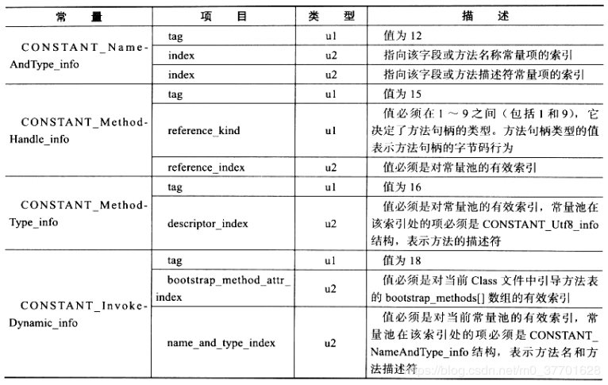
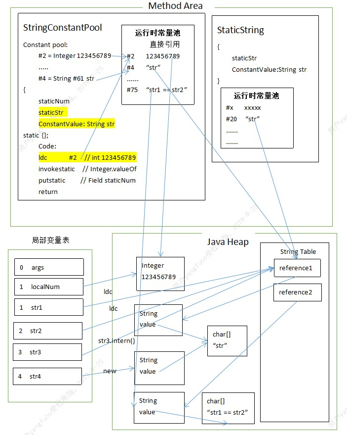

### 傻傻分不清楚
&emsp;在看《深入理解Java虚拟机》的时候，在前面的内存结构章节中，方法区中有运行时常量池，在学class文件结构的时候，又发现有class文件常量池，然后呢，还有个全局的字符串常量池（String table）。在网上搜索他们的区别，也很少有能够讲的清楚的。当然，也并不是说我就讲的清楚了。我也只是把我自己的理解用文字记录下来。以便以后还是傻傻分不清。下面将会按照他们产生的顺序开始介绍。

### class文件常量池(Constant Pool Table)
&emsp;将源代码编译成class文件后，通过javap -v -p classfile 反解析出我们能看懂的字节码（你要是能看懂二进制当我没说）。你会看到，class文件里一开头就有很大一部分是Constant Pool。里面包含了各种字面量（Literal）和符号引用(Symbal References)。字面量和Java中的常量比较接近，如文本字符串、声明为final的常量值等，符号引用包括类和接口的全限定名，方法的名称和描述符，字段的名称和描述符。

&emsp;Java代码在javac编译的时候，不像C/C++那样有连接这一步骤，而是在虚拟机加载class文件的时候进行动态连接。也就是说，在Class文件中不会保存各个方法、字段的最终内存布局信息，因此这些字段、方法的符号引用不经过运行时转换的话无法得到真正的内存入口地址。当虚拟机运行时，需要从class常量池获得对应的符号引用，再在类创建时或运行时解析、翻译到具体的内存地址中。这部分知识可以去了解类的加载过程。常量池里的内容具体是怎么定义的可以去看class文件结构的class文件常量池文章，这里不再做过多介绍。



<center>class文件常量池常量项结构.png</center>

&emsp;那么我们已经知道class文件常量池是存放字面量和符号引用的了。那么运行时常量池是什么呢？

### 运行时常量池（Runtime Constant Pool）
&emsp;JVM在执行某个类的时候，会经过类的加载机制，将其加载，连接（验证、准备、解析），初始化。那么当类被加载到内存后，JVM就会将class文件常量池里的字面量和符号引用加载进运行时常量池，而且运行时常量池是一个类对应其自己的运行时常量池。在解析阶段可以将符号引用解析为直接引用。从反解析出的字节码中可以看到，方法的调用比如invokevirtual后面会有符号引用在class文件常量池的索引。那么运行时就是拿这个符号引用的索引，去运行时常量池中查找解析后的数据。

### 字符串常量池（String Table）
&emsp;字符串常量池，在JDK1.7将其从永久代移动到了java堆。它是全局共享的，所以也叫全局字符串常量池。如下代码在JDK1.6和JDK1.7中的OOM区域不同。

```java
	
	static String str = "test";
	public static void main(String[] args){
		List<String> list = new LinkedList<>();
		while(true){
			str = str+str;
			list.add(str.intern());
		}
	}
```

* JDK1.6中是OutOfMemoryError: PermGen space
* JDK1.7及以上是OutOfMemoryError: Java heap space

&emsp;全局字符串常量池可以理解为一个HashSet<String>,**里面存储的是String对象的引用**,牢记是引用。真正的字符串其实是String类里的char[] value存储的字符数组。因为数组是引用类型，所以应该在java堆中存储着诸如"abc"=['a','b','c']这样的数据。那么，是什么时候字符串会加载进全局字符串常量池呢？下面我们就结合字节码、类加载、JVM内存结构、示意图来分析一波。


<center>3个常量池的关系图</center>

&emsp;以上是我理解的3者的关系，首先经过类加载，在初始化阶段会调用类的初始化器<clinit>对应于字节码中的static{}代码块(它会将静态属性或静态代码块在源码中的先后顺序进行组合到一个方法内)。
&emsp;静态初始化方法内有ldc字节码指令（load constant?），这个指令的作用是：根据class文件常量池中的索引号（如下方的#2），去运行时常量池中寻找对应的常量，如果没有解析，则解析，将直接引用存入运行时常量池，返回引用压入操作数栈到栈顶。如果是字符串，则会去全局字符串常量池中查找是否存在（类似equals）,存在则直接返回全局字符串常量池中的引用，不存在则在堆中创建一个String对象，把引用存入全局字符串常量池并返回其引用压入栈顶。
其实class常量池中的常量加载到运行时常量池中，对它的解析resolve是lazy的。只有遇到ldc指令的时候才会去判断是否解析，没解析则解析。因为类加载最后是初始化，类静态属性的初始化赋值就会执行ldc指令，所以类加载完staticNum就已经解析了。但是如果是main方法中“str1 == str2”这样的字面量，只有在第一次运行到ldc命令的时候去真正解析。

```java
	
	... ...

	Constant pool:
	   #1 = Methodref          #25.#56        // java/lang/Object."<init>":()V
	   #2 = Integer            123456789
	      
	... ...

	  static {};
	    descriptor: ()V
	    flags: ACC_STATIC
	    Code:
	      stack=1, locals=0, args_size=0
	         0: ldc           #2                  // int 123456789
	         2: invokestatic  #3                  // Method java/lang/Integer.valueOf:(I)Ljava/lang/Integer;
	         5: putstatic     #22                 // Field staticNum:Ljava/lang/Integer;
	         8: return
	    
	}	

```

&emsp;重新整理下"str"这个字面量从class文件到main方法运行时的过程，类加载时“str”从class文件常量池加载进运行时常量池，并在类初始化阶段执行生成的初始化方法中第一次执行ldc命令，ldc命令检查到该字面量未解析，去全局字符串常量池中查找，也无对应引用，所以在堆中创建String对象，将其引用存入全局字符串常量池，返回这个引用，ldc命令将之加载到操作数栈顶，后面的putstatic将这个引用赋值给类静态属性staticStr；
然后main方法里，另一个StaticString.str也是类初始化阶段执行ldc命令，运行时常量池中没解析，不过它在全局字符串常量池中发现有引用（StringConstantPool生成的），直接返回该引用，所以他们两个==为true;str1这个局部变量也使用ldc指令去本类运行时常量池中将字符串载入栈顶，发现已解析，返回直接引用压入栈顶；str2同理；str3调用构造器，查看源码发现，其实是将String对象的value属性赋值给新String对象；str4调用str3.intern(),该方法去全局字符串常量池中查找是否有等于str3（equals）的引用，发现有（前面类属性staticStr通过ldc产生的），返回全局字符串常量池中的引用。

&emsp;讲到这里，你可能以为已经掌握了class文件常量池、运行时常量池、全局字符串常量池中字符串的关系。但是其实还有JIT及时编译器优化（逃逸分析，栈上分配，标量替换，方法内联等）。详细参考R大的文章https://www.iteye.com/blog/rednaxelafx-774673
本篇笔记参考的资料有：
1.《深入理解Java虚拟机》
2.https://www.zhihu.com/question/55994121/answer/147296098
3.https://www.iteye.com/blog/rednaxelafx-774673
