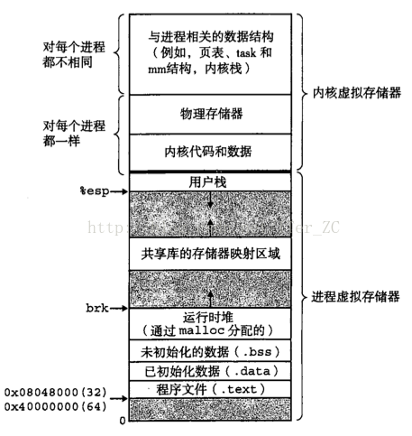

### 虚拟内存与JVM内存结构
&emsp;在我们学习c语言/操作系统的时候，知道进程的内存结构有代码段，数据段[初始化数据段（初始化的全局和静态变量），未初始化数据段(又称bbs，未初始化的全局变量和静态变量)]，堆，共享库，栈，内核空间。详细了解可以搜索虚拟内存相关知识。 
<!-- more -->

<center>图1.虚拟内存结构</center>


 
&emsp;虚拟机的内存结构与进程的虚拟内存结构类似，那么Java虚拟机是怎么抽象它的内存结构的呢？根据Java虚拟机规范，JVM所管理的内存包含以下几个运行时区域。可以按线程隔离和共享来分类。共享的有堆、方法区，线程隔离的有PC程序计数器、虚拟机栈、本地方法栈。如下图所示：


<center>图2.JVM内存结构概览</center>

### 程序计数器

&emsp;CPU的寄存器中有一个指令寄存器IP(64位RIP,32位EIP,也称为程序计数器PC),存放下一条指令在内存中的地址。JVM内存结构中的PC可以理解为是CPU中的PC的抽象，指向的是内存中字节码指令的地址（可以简单理解为字节码指令的行号）。因为在多核CPU中，每个核跑一个线程，所以Java程序的多个线程可以同时运行，所以每个线程就需要各自的PC。如果是线程执行的是一个Java方法，那么PC记录的是指令的地址。如果是Native方法，则这个PC的值为空null。

### Java虚拟机栈
&emsp;同样的Java的虚拟机栈也可以理解为虚拟内存中栈的抽象。也是线程私有的，它们功能都是一样的，存储的是方法执行的栈帧（Stack Frame）。方法的调用和返回代表的就是虚拟机栈的入栈和出栈操作。栈顶就是当前线程正在执行的方法的栈帧。栈帧中存储的就是方法执行需要的一些信息，如局部变量表、操作数栈、方法出口等。

&emsp;**局部变量表**存放了编译器就知道了的各种基本数据类型（boolean,byte,char,short,int,float,long,double）、对象引用、returnAddress类型（指向一条字节码指令的地址）。可以把局部变量表理解为一个数组，其中long和double占用占用2个槽位（slot）,其余的都是占用1个槽位。32位虚拟机long和double用2个槽位存储数据，即使是64位的虚拟机，long和double也是2个槽位（1个槽位存储64位数据，另一个槽位为空）。

&emsp;局部变量表的大小在编译期就确定了，在运行时是不会改变其大小的。如果是对象方法的局部变量表，第一个slot是this指针，这也是为什么每个非静态方法里可以访问this的原因，静态方法则不存在this指针。然后是方法入参，然后是方法体中的局部变量。就是这样即使是我们自己，也可以很好判断局部变量表的大小。

&emsp;**操作数栈**就是字节码指令需要的操作数，在某些指令执行前需要提前将操作数压入操作数栈，比如iadd，则需要提前将两个整数压入操作数栈中。对应的指令是iload(从局部变量表指定位置将数据加载到操作数栈栈顶)。同样，操作数栈的大小在编译期就已经确定。

&emsp;**返回地址**，当一个方法被执行后，有两种方式退出这个方法。第一种方式是执行引擎遇到任意一个方法返回的字节码指令，这时候可能会有返回值传递给上层的方法调用者，是否有返回值和返回值的类型将根据遇到何种方法返回指令来决定，这种退出方法的方式称为正常完成出口（Normal Method Invocation Completion）。

另外一种退出方式是，在方法执行过程中遇到了异常，并且这个异常没有在方法体内得到处理，无论是Java虚拟机内部产生的异常，还是代码中使用athrow字节码指令产生的异常，只要在本方法的异常表中没有搜索到匹配的异常处理器，就会导致方法退出，这种退出方法的方式称为异常完成出口（Abrupt Method Invocation Completion) 。一个方法使用异常完成出口的方式退出，是不会给它的上层调用者产生任何返回值的。

无论采用何种退出方式，在方法退出之后，都需要返回到方法被调用的位置，程序才能继续执行，方法返回时可能需要在栈帧中保存一些信息，用来帮助恢复它的上层方法的执行状态。一般来说，方法正常退出时，调用者的PC计数器的值就可以作为返回地址，栈帧中很可能会保存这个计数器值。而方法异常退出时，返回地址是要通过异常处理器表来确定的，栈帧中一般不会保存这部分信息。

方法退出的过程实际上等同于把当前栈帧出栈，因此退出时可能执行的操作有：恢复上层方法的局部变量表和操作数栈，把返回值（如果有的话）压入调用者栈帧的操作数栈中，调整PC计数器的值以指向方法调用指令后面的一条指令等。


&emsp;在这个虚拟机栈中可能会出现两个异常：如果线程请求的栈的深度大于虚拟机所允许的深度，将抛出StackOverflowError异常；如果虚拟机栈动态扩展时申请不到足够的内存，就会抛出OutOfMemoryError异常。可以通过下方的代码进行测试

```java

	/**
	 * VM args: -Xss128k
	 *
	 */
	public class JavaVMStackSOF {
	
	    private int stackLength;
	
	    public void stackLeak() {
	        stackLength ++ ;
	        stackLeak();
	    }
	
	    public static void main(String[] args){
	        JavaVMStackSOF javaVMStackSOF = new JavaVMStackSOF();
	        try {
	            javaVMStackSOF.stackLeak();
	        } catch (Throwable e) {
	            System.out.println("stack length:"+javaVMStackSOF.stackLength);
	            throw e;
	        }
	    }
	}

```

&emsp;扩展，当后面学习了class文件，字节码指令后，可以使用命令javap -v -p classfile反解析出字节码,查看局部变量表的大小，以及每个槽位存储的是什么。如下代码所示：

```java  

	public static void staticMethod(String str){
	        System.out.println("static method "+str);
	    }
	
	public int virtualMethod(String word, Integer i){
	        System.out.println(word);
	        return i;
	    }
```

对应的字节码: 

```java

	public int virtualMethod(java.lang.String, java.lang.Integer);
	    descriptor: (Ljava/lang/String;Ljava/lang/Integer;)I
	    flags: ACC_PUBLIC
	    Code:
	      stack=2, locals=3, args_size=3
	         0: getstatic     #11                 // Field java/lang/System.out:Ljava/io/PrintStream;
	         3: aload_1
	         4: invokevirtual #13                 // Method java/io/PrintStream.println:(Ljava/lang/String;)V
	         7: aload_2
	         8: invokevirtual #16                 // Method java/lang/Integer.intValue:()I
	        11: ireturn
	      LineNumberTable:
	        line 29: 0
	        line 30: 7
	      LocalVariableTable:
	        Start  Length  Slot  Name   Signature
	            0      12     0  this   Lpractice/bytecode/BytecodeCommand;
	            0      12     1  word   Ljava/lang/String;
	            0      12     2     i   Ljava/lang/Integer;
	
	public static void staticMethod(java.lang.String);
	    descriptor: (Ljava/lang/String;)V
	    flags: ACC_PUBLIC, ACC_STATIC
	    Code:
	      stack=2, locals=1, args_size=1
	         0: getstatic     #11                 // Field java/lang/System.out:Ljava/io/PrintStream;
	         3: aload_0
	         4: invokevirtual #13                 // Method java/io/PrintStream.println:(Ljava/lang/String;)V
	         7: return
	      LineNumberTable:
	        line 41: 0
	        line 42: 7
	      LocalVariableTable:
	        Start  Length  Slot  Name   Signature
	            0       8     0   str   Ljava/lang/String;
```

### 本地方法栈
&emsp;这个栈与虚拟机栈结构类似，是Native方法执行时的栈帧。不同的虚拟机有不同的实现，Hotspot虚拟机是将两者合二为一的。

### Java堆
&emsp;在C中，堆是动态内存区域，由malloc()函数分配内存，Hotspot虚拟机是由C++实现的，那么对象创建可能是由C++ new操作符实现的。具体的可能要看虚拟机源码才能清楚，总之，先不管是由什么实现，先理解Java虚拟机的中的堆。Java堆可以说是虚拟机中最大的一块内存了，它的唯一目的就是存放实例对象的数据，通过new出的对象和数组一般都是放到堆中的。随着JIT编译器的发展和逃逸分析技术的成熟，**栈上分配、标量替换**优化技术使得不再完全是堆上分配。栈上分配c语言有个函数alloca()就是进行栈上分配内存。标量替换：通过逃逸分析确定该对象不会被外部访问，并且对象可以被进一步分解时，JVM不会创建该对象，而会将该对象成员变量分解若干个被这个方法使用的成员变量所代替。这些代替的成员变量在栈帧或寄存器上分配空间，这样就加快了数据的访问。

&emsp;Java堆是垃圾收集器管理的主要区域，这里有大量对象朝生夕死，也有老顽固存活下来。垃圾收集器基本上是**分代收集算法**，所以垃圾收集器把Java堆分为 年轻代{eden区、survivor区[survivor from(s0)、survicor to(s1)]}、老年代。从内存分配角度来看，为了解决并发分配对象的效率，线程共享的堆中又各自有各自的**TLAB线程本地分配缓冲区**（Thread Local Allocation Buffer）使用-XX:+/-UseTLAB开启关闭（默认开启）。如果不使用TLAB,那么线程在请求内存的时候就会竞争，虽然不是用synchronized同步锁住整个区域，而是使用的CAS（Compare And Swap比较并交换）加失败重试(即轻量级锁)，但仍然会存在竞争而消耗性能。而TLAB的话，线程隔离，平常分配不需要同步，只有TLAB不够分配了，申请新的TLAB才会在整个区域重新申请内存而使用同步CAS去操作。


<center>图3.堆内存分代结构</center>

&emsp;Java堆内存大小由Xms初始大小（memory start）,Xmx最大内存(memory max)这两个参数控制。形成可扩展的堆内存。如果申请内存时不能再扩展了，就会抛出OutOfMemoryError异常。以下是测试代码：
```java  

	import java.util.ArrayList;
	import java.util.List;
	
	public class HeapOOM {
	
	    public static void main(String[] args){
	        String test = "heapOOm";
	        List<String> list = new ArrayList<>(100000);
	        while (true){
	            String str = test + test;
	            list.add(str.intern());
	        }
	    }
	}

```

```java

	Exception in thread "main" java.lang.OutOfMemoryError: Java heap space
		at java.util.Arrays.copyOf(Arrays.java:3210)
		at java.util.Arrays.copyOf(Arrays.java:3181)
		at java.util.ArrayList.grow(ArrayList.java:261)
		at java.util.ArrayList.ensureExplicitCapacity(ArrayList.java:235)
		at java.util.ArrayList.ensureCapacityInternal(ArrayList.java:227)
		at java.util.ArrayList.add(ArrayList.java:458)
		at practice.heapOOM.HeapOOM.main(HeapOOM.java:13)

```

&emsp;一般来说，引起堆OOM的，要么是系统长时间运行，存在内存泄漏leak,积少成多最终导致垃圾收集器无法回收这些没用的对象数据，要么是本身配置的内存就不够，动态扩展时申请不到内存，出现内存溢出。


### 方法区
&emsp;从名字就可以看出来，这个区域主要是存储方法的。class文件的字节码经过类加载后就进入了方法区变成class对象，所以方法区存储的是类的相关信息（如类名、访问修饰符、运行时常量池、字段描述、方法描述等），即时编译器JIT编译后的代码等数据。GC垃圾收集器在1.7及以前把该区域叫做永久代（和堆是逻辑上连续的），1.8后叫做元空间metaspace，使用Native Memory来分配空间，这样元空间的大小就由32/64位系统的虚拟内存可用大小决定，但也可用MaxMetaspaceSize参数限制。元空间是Hotspot对方法区的具体实现。并且JDK1.7及以后把在永久代的字符串常量池移到堆内存中了。

&emsp;要测试方法区的OOM,基本思路是在运行时产生大量的类去填满方法区，直到溢出。所以，我们可以使用CGLib直接操作字节码运行时生成大量的动态类。示例代码如下：

```java

	import net.sf.cglib.proxy.Enhancer;
	import net.sf.cglib.proxy.MethodInterceptor;
	import net.sf.cglib.proxy.MethodProxy;
	
	import java.lang.reflect.Method;
	
	/**
	 * VM args: -XX:MaxMetaspaceSize=10m
	 *
	 */
	public class MethodAreaClassOOM {
	
	    static class OOMObject{}
	
	    public static void main(String[] args)
	    {
	        while(true)
	        {
	            Enhancer enhancer = new Enhancer();
	            enhancer.setSuperclass(OOMObject.class);
	            enhancer.setUseCache(false);
	            enhancer.setCallback(new MethodInterceptor() {
	                @Override
	                public Object intercept(Object obj, Method method, Object[] args, MethodProxy proxy) throws Throwable
	                {
	                    return proxy.invokeSuper(obj, args);
	                }
	            });
	            enhancer.create();
	        }
	    }
	}
```

```java  

	Caused by: java.lang.OutOfMemoryError: Metaspace
		at java.lang.ClassLoader.defineClass1(Native Method)
		at java.lang.ClassLoader.defineClass(ClassLoader.java:760)
		... 11 more
```

### 运行时常量池
&emsp;Class文件除了类的版本、字段、方法、接口等信息外，还有一项信息是常量池（Constants Pool Table），用于存放编译期生成的各种**字面量和符号引用**，这部分内容将在类加载后进入方法区每个类的运行时常量池，当然也会把翻译出的直接引用存储在运行时常量池中。

&emsp;扩展：比较了解 class文件常量池，运行时常量池，字符串常量池 与类加载过程的关系（待总结）

### 直接内存
&emsp;直接内存并不是虚拟机运行时数据区的一部分，也不是Java虚拟机规范中定义的内存区域。但是这部分内存也被频繁的使用，而且也可能导致OOM异常出现。
在JDK1.4中新加入的NIO(New Input/Output)类，引入了一种基于通道channel的与缓冲区buffer的I/O方式，它可以使用Native函数库直接分配堆外内存，然后通过一个存储在Java堆中的DirectByteBuffer对象作为这块内存的引用进行操作。这样显著提升了性能，因为避免了在堆内存和Native堆中来回复制数据。

&emsp;虽然直接内存的分配不会收到Java堆的大小限制，但是会收到本机总物理内存或虚拟内存地址空间大小限制。如果配置Xmx时忽略了这部分直接内存，导致运行时加起来超过了限制，动态扩展时就会出现OOM异常。可通过-XX:MaxDirectMemorySize指定直接内存的大小。如果不指定，默认与-Xmx一样大。以下是测试OOM代码，代码越过DirectByteBuffer类，直接通过反射获取Unsafe实例进行内存分配（Unsafe类的getUnsafe()方法限制了只有引导类加载器才会返回实例，也就是只有rt.jar中的类才能使用Unsafe）。

```java

	/**
	 * VMargs: -XX:DirectMemorySize=10M
	 *
	 */
	public class DirectMemoryOOM {
	
	    private static final int ONE_MB = 1024 * 1024;
	
	    public static void main(String[] args) throws NoSuchFieldException, IllegalAccessException {
	
	        Field field = Unsafe.class.getDeclaredField("theUnsafe");
	        field.setAccessible(true);
	        Unsafe unsafe = (Unsafe) field.get(null);
	        while (true) {
	            unsafe.allocateMemory(ONE_MB);
	        }
	    }
	
	}

```

```java
	
	Exception in thread "main" java.lang.OutOfMemoryError
		at sun.misc.Unsafe.allocateMemory(Native Method)
		at practice.directMemoryOOM.DirectMemoryOOM.main(DirectMemoryOOM.java:21)

```

